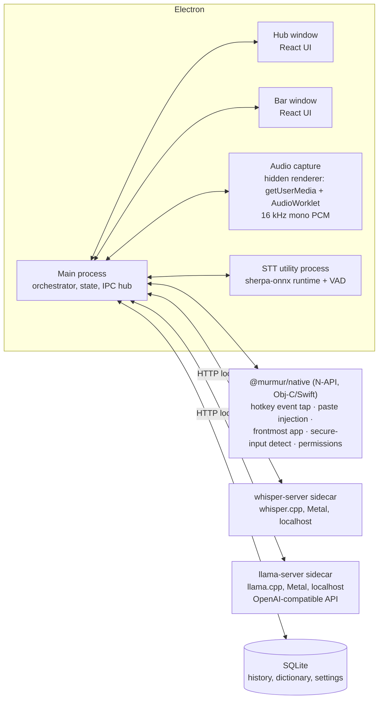

# Murmur — Product & Engineering Plan

**A local-first dictation app for macOS.** Hold a key, speak, release — polished text appears wherever your cursor is. The user experience mirrors Wispr Flow, but every byte of audio and text stays on the machine: speech-to-text and text polishing both run on local models that the user chooses, including models developed outside the US.

> Status: planning document, v1. Nothing in this repo is built yet; this is the blueprint.

---

## 1. Why this exists

- Company policy forbids cloud dictation tools (Wispr Flow, Superwhisper cloud modes, etc.) because dictated audio/text leaves the machine.
- Existing local tools don't combine all of: Wispr-Flow-grade UX, an LLM "polishing" pass, and free choice of models (including non-US-origin models).
- Goal: a tool an IT/security team can approve at a glance — **no audio, transcript, or telemetry ever leaves the device**. The only network traffic is model downloads, which are user-initiated and auditable.

### Goals (v1)

1. System-wide push-to-talk dictation on macOS: hold hotkey → speak → release → text inserted into the frontmost app.
2. Fully local speech-to-text (STT) and local LLM polishing (filler removal, punctuation, formatting, tone).
3. User-selectable models for both stages, from a curated catalog labeled by **country of origin**, license, size, and hardware needs — plus "bring your own model" (any GGUF / ONNX / OpenAI-compatible local endpoint).
4. Wispr Flow's interface shape: a floating **Bar** (recording pill) + a **Hub** window (history, dictionary, style, settings) + menu-bar presence.
5. Signed, notarized Electron app distributed as a DMG (not Mac App Store — see §15).

### Non-goals (v1)

- Windows/Linux (Electron keeps the door open; macOS-only integrations are isolated behind an interface).
- Mobile, sync, accounts, teams.
- Real-time streaming captions (arrives in M5 as an upgrade; v1 transcribes on key-release).
- Cloning Wispr Flow pixel-for-pixel. We mirror the *interaction model and layout*, with our own name, icon, visual styling, and copy — same UX shape, distinct trade dress.

---

## 2. UX specification (mirroring Wispr Flow's shape)

Wispr Flow's desktop app lives in two places: the **Flow Bar** (floating pill at the bottom of the screen) and the **Hub** (main window for history/personalization/settings), plus a menu-bar item. Murmur adopts the same triad.

### 2.1 The Bar (floating recording pill)

A small, frameless, always-on-top, non-activating window centered at the bottom of the active display.

States:

| State | Visual | Trigger |
|---|---|---|
| Hidden | — | default |
| Listening | pill expands, live waveform bars, mic name tooltip | hotkey down |
| Hands-free listening | same + pinned indicator | double-tap hotkey (exit: tap again or Esc) |
| Processing | waveform collapses to spinner/shimmer | hotkey up |
| Inserted | brief ✓ flash, then hide | text injected |
| Error | red tint + short message ("No speech detected", "Mic in use", "Secure field — can't type here") | failure |

Behavior details:

- Visible on all Spaces and over full-screen apps (`visibleOnFullScreen`), never steals focus (`acceptsFirstMouse` off, panel-style window).
- Click-through except for a small hover area exposing: cancel (Esc), mic picker, and "open Hub".
- While listening, show input level meter driven by the audio worklet (no transcript preview in v1; streaming preview arrives M5).

### 2.2 The Hub (main window)

Left sidebar navigation, content pane right — Wispr Flow's layout:

1. **Home / History** — reverse-chronological feed of dictations: polished text (primary), expandable raw transcript, target app icon, duration, copy button, delete. Header stats like Flow's: total words dictated, average WPM, daily streak. Full-text search.
2. **Dictionary** — user-managed vocabulary: proper nouns, jargon, acronyms + optional "replace X with Y" rules (e.g., "murmer → Murmur", "eta → ETA"). Fed to both STT biasing and the polish prompt (§7.4). "Add from correction" flow later (M4).
3. **Style** — tone controls per app category (Personal / Work / Email / Other), mapped from the frontmost app's bundle ID. Options per category: capitalization/punctuation strictness, formality, emoji allowance, filler-word handling. Plus a global "polishing level": Off (raw transcript) / Clean (punctuation, fillers, self-corrections) / Rewrite (tone + structure).
4. **Models** — the model manager (§8): pick STT model, pick polish model, download/delete, disk usage, region & license badges, custom model import, advanced: external OpenAI-compatible endpoint (e.g., company-approved LM Studio/Ollama).
5. **Settings** — hotkey config (default: hold `fn`, like Flow; alternatives Right-⌘/Right-⌥ for external keyboards), double-tap for hands-free, mic selection, language(s), launch at login, audio retention toggle (default **off** — audio deleted after transcription), history retention window, appearance (system/dark/light).
6. **Help** — permissions status panel (re-check/fix buttons), troubleshooting, logs export (local only).

### 2.3 Menu bar

Template icon (mic glyph; subtle state change while listening). Menu: Open Hub · Start hands-free dictation · Mic picker · Language · Pause Murmur · Quit. No Dock icon by default (`LSUIElement`), toggleable.

### 2.4 Onboarding (first run)

1. Welcome → 2. **Microphone** permission → 3. **Accessibility** permission (for text insertion) → 4. **Input Monitoring** permission (for the global hotkey) → 5. Pick + download a starter model pair with disk-size shown (offer a "smallest" and "recommended" bundle) → 6. Interactive tutorial: "hold `fn` and say *testing one two three*" into a practice text field → 7. Done; note about macOS's built-in double-fn dictation conflict with a one-click "open Keyboard settings" to disable it.

Each permission screen shows exactly why it's needed and what is *not* done (no keylogging — the tap listens only for the configured hotkey; no screen reading).

---

## 3. System architecture

Electron app + native glue + local inference sidecars. The renderer never touches models, audio devices are read in one place, and inference runs outside the Electron main process so the UI never jitters.



### 3.1 Process roles

- **Main process** — the state machine (idle → listening → transcribing → polishing → inserting), window/tray management, model lifecycle, settings, SQLite. Typed IPC contract shared with renderers.
- **Hub / Bar windows** — plain React; no Node integration, context-isolated, talk over typed IPC only.
- **Audio capture** — a hidden renderer using `getUserMedia` + `AudioWorklet` downsampling to 16 kHz mono Float32 frames streamed to main via IPC. Renderer-side capture avoids native audio code and gets device-picker + level metering for free. (If latency or reliability disappoints, fallback plan: AVAudioEngine in `@murmur/native`.)
- **STT utility process** — Electron `utilityProcess` hosting **sherpa-onnx** (Node addon) for ONNX-family models (Parakeet, SenseVoice, Paraformer, Moonshine, streaming Zipformer) and **Silero VAD** for trimming silence and hands-free endpointing. Keeps models resident between utterances; crash-isolated and restartable.
- **whisper-server sidecar** — bundled `whisper.cpp` server binary (Metal + Core ML on Apple Silicon) for the Whisper family. Spawned on demand, bound to `127.0.0.1` on a random port with a per-session auth token; model stays loaded between utterances.
- **llama-server sidecar** — bundled `llama.cpp` server (Metal) exposing the OpenAI-compatible chat API for the polishing pass. Because polishing already speaks OpenAI-compatible HTTP, "use an external local endpoint" (Ollama / LM Studio / company-hosted vLLM) is the same code path with a different base URL.
- **`@murmur/native`** — one small N-API module (Obj-C/Swift) for everything Electron can't do: CGEventTap hotkey listening (incl. the `fn` key via `flagsChanged`), paste injection, frontmost-app lookup, secure-input detection, permission checks/prompts. Detailed in §4.

### 3.2 The dictation loop (happy path)

1. Native tap reports hotkey-down → main enters *listening*, shows Bar, starts audio capture.
2. Hotkey-up → stop capture, VAD-trim the buffer, show *processing*.
3. Buffer → active STT engine (utility process or whisper-server) → raw transcript.
4. Dictionary replacements applied; if polishing is on → llama-server with the tone profile for the frontmost app's category → polished text. (Utterances under ~3 words skip polish by default — not worth the latency.)
5. Injection: save clipboard → set clipboard to text → synthetic ⌘V via native module → restore clipboard (~150 ms later). Fallback: AX `AXUIElement` insertion for apps that block synthetic keystrokes; if the focused field has **secure input** enabled (password fields), refuse with a Bar error instead of typing.
6. Persist history row (raw + polished + app + timings), update stats, hide Bar.

Cancel paths: Esc during listening; empty/silent audio → "No speech detected"; every stage has a timeout that surfaces a Bar error rather than hanging.

---

## 4. macOS integration details (the hard, load-bearing part)

| Concern | Approach | Permission |
|---|---|---|
| Global hold-to-talk hotkey, incl. `fn` | `CGEventTap` (listen-only) for `keyDown/keyUp/flagsChanged`; `fn` arrives as `flagsChanged` with `.maskSecondaryFn`. Debounce; double-tap detection for hands-free. Electron's `globalShortcut` cannot do key-up or `fn`, hence native. | Input Monitoring |
| Text insertion | Clipboard-swap + synthetic ⌘V (`CGEventPost`), the same technique Flow-class apps use; AX insertion fallback; never type into secure input (`IsSecureEventInputEnabled` check). | Accessibility |
| Frontmost app (for tone category + history) | `NSWorkspace.frontmostApplication` bundle ID. No window titles, no screen content. | none |
| Mic capture | `getUserMedia` in hidden renderer; `com.apple.security.device.audio-input` entitlement + `NSMicrophoneUsageDescription`. | Microphone |
| Permission UX | `AXIsProcessTrustedWithOptions`, `CGPreflightListenEventAccess`/`CGRequestListenEventAccess`, `AVCaptureDevice.authorizationStatus` — surfaced in onboarding + Help panel with deep links into System Settings panes. | — |
| Conflict: macOS built-in dictation on double-`fn` | Detect setting, warn during onboarding, link to Keyboard settings. | — |
| Bar window | Frameless, transparent, `screen-saver` level, all-Spaces + `visibleOnFullScreen`, non-activating panel behavior, click-through except controls. | — |

Prototype-stage shortcut: `uiohook-napi` can stand in for the event tap during M1 development, but the plan of record is our own tap in `@murmur/native` — `fn` handling, key *suppression* while dictating (so hold-`fn` doesn't also trigger app shortcuts), and double-tap timing all want first-party control.

Bundled sidecar binaries (`whisper-server`, `llama-server`) are compiled in CI for arm64 + x86_64, code-signed with hardened runtime, and shipped inside `Contents/Resources/bin/` (notarization requirement — see §15 risks).

---

## 5. Audio pipeline

- Format: 16 kHz mono Float32 (what every candidate STT model wants). Downsample in an `AudioWorklet`; ship ~100 ms frames over IPC.
- Pre-roll ring buffer: capture starts *on hotkey-down*, but keep a ~300 ms rolling pre-buffer once the mic stream is warm so first syllables aren't clipped; mic stream is opened lazily on first dictation and kept warm for a configurable idle window (default 5 min) to avoid cold-start latency.
- **VAD (Silero, via sherpa-onnx)**: trim leading/trailing silence before STT; in hands-free mode, auto-finalize an utterance after ~800 ms of silence; hard cap per-utterance length (default 5 min, configurable).
- Echo/noise: rely on macOS voice-processing input (`echoCancellation: true` constraint) — good enough v1; revisit if AirPods/laptop-mic feedback complaints appear.
- Audio is held in memory only and discarded after transcription unless the user opts into retention (§10).

---

## 6. Speech-to-text layer

### 6.1 Engine abstraction

```ts
interface SttEngine {
  id: string;                       // "sherpa-onnx" | "whisper-cpp" | future
  load(model: ModelRef, opts: SttOptions): Promise<void>;   // model stays resident
  transcribe(pcm: Float32Array, opts: UtteranceOpts): Promise<Transcript>;
  transcribeStreaming?(frames: AsyncIterable<Float32Array>): AsyncIterable<PartialTranscript>; // M5
  unload(): Promise<void>;
}
```

Two engines cover the whole catalog:

| Engine | Runs | Why |
|---|---|---|
| **sherpa-onnx** (Node addon in utility process) | Parakeet (NeMo transducer ONNX), SenseVoice, Paraformer, Moonshine, streaming Zipformer, Silero VAD | One runtime, many architectures, prebuilt Node bindings, streaming support for M5, CPU int8 fast enough for real-time on any Mac |
| **whisper.cpp** (`whisper-server` sidecar) | Whisper family (large-v3-turbo, distil, quantized) | Best Whisper performance on Apple Silicon (Metal + Core ML encoder); Whisper remains the multilingual quality bar |

A third path — **audio-LLMs via llama.cpp** (Mistral's Voxtral Mini 3B) — reuses the llama-server sidecar and is flagged experimental (§6.3).

### 6.2 Curated STT catalog (v1)

Every entry shows **origin, license, size, languages, engine** in the picker so users can filter to non-US models at a glance. Sizes are quantized on-disk estimates.

| Model | Origin | License | Disk | Languages | Engine | Notes |
|---|---|---|---|---|---|---|
| **SenseVoice-Small** (Alibaba FunAudioLLM) | 🇨🇳 China | Apache-2.0 (model card) | ~250 MB int8 | zh, en, yue, ja, ko | sherpa-onnx | Non-autoregressive → ~15× faster than Whisper-large; **default non-US pick** |
| **Paraformer-large** (Alibaba FunASR) | 🇨🇳 China | Apache-2.0 | ~230 MB int8 | zh, en | sherpa-onnx | Mature, excellent Mandarin |
| **Whisper large-v3-turbo** (OpenAI) | 🇺🇸 US | MIT | ~1.6 GB q5 | ~100 languages | whisper.cpp | Multilingual quality default |
| **Distil-Whisper / small.en** | 🇺🇸 US | MIT | 150–500 MB | en | whisper.cpp | Low-RAM fallback |
| **Parakeet-TDT 0.6B v2/v3** (NVIDIA) | 🇺🇸 US | CC-BY-4.0 | ~650 MB int8 | v2 en; v3 25 European langs | sherpa-onnx | Fastest high-accuracy English; **default US pick** |
| **Moonshine base** (Useful Sensors) | 🇺🇸 US | MIT | ~60 MB | en | sherpa-onnx | Tiny; old-Intel-Mac tier |
| **Voxtral Mini 3B** (Mistral) | 🇫🇷 France | Apache-2.0 | ~2.5 GB q4 | 8+ langs | llama.cpp (experimental) | Audio-LLM; can transcribe **and** polish in one pass (§6.3) |
| **Kyutai STT 1B** (Kyutai Labs) | 🇫🇷 France | CC-BY-4.0 | ~1 GB | en, fr | *future* (Rust sidecar) | Purpose-built streaming; M5 candidate |
| **FireRedASR-AED-S** (Xiaohongshu) | 🇨🇳 China | Apache-2.0 | ~600 MB | zh, en | sherpa-onnx | Strong Mandarin alternative |

Watch list (re-evaluate at build time; the catalog is a signed JSON file the app can update, §8): Cohere's open ASR model (🇨🇦, currently tops the Open ASR Leaderboard — include when a local ONNX/GGUF runtime lands), NVIDIA Canary-Qwen, IBM Granite Speech.

**Recommended defaults:** 8 GB Mac → SenseVoice-Small (non-US) or Moonshine (US); 16 GB+ → Parakeet v3 or Whisper large-v3-turbo. Onboarding offers one non-US and one US default; the user picks.

### 6.3 Voxtral combo mode (experiment, M5)

Voxtral Mini 3B ingests audio directly in llama.cpp. One model, one pass: audio in → polished text out, honoring the tone prompt. If quality/latency prove out on 16 GB Apple Silicon, this becomes the flagship "one non-US model does everything" configuration. Kept experimental until llama.cpp's audio path proves stable across updates.

### 6.4 Accuracy aids

- **Hotword biasing**: sherpa-onnx supports hotword lists (dictionary terms boost); Whisper gets dictionary terms via `initial_prompt`.
- **Post-STT replacement rules** from the Dictionary run before polishing.
- Language: manual selection in v1 (auto-detect only where the model does it natively, e.g. Whisper/SenseVoice); per-language model routing later.

---

## 7. Polishing layer (local LLM)

### 7.1 Engine

`llama-server` (llama.cpp) sidecar with the OpenAI-compatible `/v1/chat/completions` API. Model resident between utterances; unloadable after idle timeout (configurable) to release RAM. Alternative backend = any OpenAI-compatible **local** URL (Ollama, LM Studio, company vLLM box) — same client code; the app warns if the endpoint isn't loopback/RFC-1918 so "local-only" stays honest.

### 7.2 Curated polish-model catalog (v1)

Task profile: short-input, short-output rewriting — needs instruction-following and speed, not reasoning. Small models excel here.

| Model | Origin | License | Disk (Q4) | RAM tier | Notes |
|---|---|---|---|---|---|
| **Qwen3-4B-Instruct-2507** (Alibaba) | 🇨🇳 China | Apache-2.0 | ~2.5 GB | 16 GB | **Default non-US pick** — best small-model instruction following |
| **Qwen3-1.7B** (Alibaba) | 🇨🇳 China | Apache-2.0 | ~1.1 GB | 8 GB | Default for low-RAM; run with thinking disabled |
| **Ministral / Mistral 7B v0.3** (Mistral) | 🇫🇷 France | Apache-2.0 | ~4.1 GB | 16 GB | European option |
| **EuroLLM-1.7B / 9B** (EU consortium) | 🇪🇺 EU | Apache-2.0 | 1.1–5.5 GB | 8–16 GB | EU-funded, 24 official EU languages |
| **GLM-Edge-1.5B / 4B** (Zhipu) | 🇨🇳 China | custom (permissive) | 1–2.5 GB | 8–16 GB | Designed for on-device |
| **Falcon-H1 1.5B / 3B** (TII) | 🇦🇪 UAE | Apache-2.0 | 1–2 GB | 8–16 GB | Another non-US lineage |
| **Gemma 3 4B** (Google) | 🇺🇸 US | Gemma license | ~2.6 GB | 16 GB | US option, strong rewriter |
| **Phi-4-mini** (Microsoft) | 🇺🇸 US | MIT | ~2.4 GB | 16 GB | US option |
| *Bring your own GGUF* | — | — | — | — | File picker or HF repo ID |

(Exact SKUs re-verified when the catalog file is authored — small-model releases move monthly; catalog updates don't require app releases, §8.)

### 7.3 Latency budget (hotkey-up → text inserted, 5 s utterance, M-series 16 GB)

| Stage | Target |
|---|---|
| VAD trim + transfer | < 50 ms |
| STT (Parakeet/SenseVoice int8) | 150–500 ms |
| STT (Whisper turbo, Metal) | 500–1000 ms |
| Polish (Qwen3-1.7B/4B Q4, ~50 tok out) | 300–800 ms |
| Injection | < 100 ms |
| **End-to-end target** | **≤ 1.5 s typical, ≤ 2.5 s with Whisper turbo** |

Tricks: skip polish for ≤3-word utterances; cap polish output tokens relative to input length; keep both models resident; warm the llama context with the system prompt (prompt caching) so per-utterance prompt processing is minimal; thinking-mode models always run with thinking off.

### 7.4 Polish prompt design

System prompt assembled per utterance from: polishing level (Clean/Rewrite), tone profile for the frontmost app category, dictionary terms, output-language rule ("reply in the transcript's language"), and hard rules: *never answer questions, never add content, never translate — you are a transcription editor, output only the edited text.* Few-shot examples ship per polishing level. Self-correction handling ("send it Tuesday — no wait, Wednesday" → "send it Wednesday") is the marquee Clean-level behavior and gets its own eval set (§13.4). Numbered/bulleted list detection ("one… two… three…" → markdown list) at Rewrite level, matching Flow's auto-formatting.

Guardrail: if polish output diverges wildly in length from input (hallucination guard), fall back to the raw transcript and log it (locally).

---

## 8. Model manager

- **Catalog** = a versioned, signed JSON file shipped with the app (updatable independently of app releases): model metadata, origin, license, quant variants, SHA-256 checksums, download URLs with mirrors.
- **Sources**: Hugging Face primary; **ModelScope mirror** for each Chinese-origin model (useful when HF is slow/blocked); all downloads resumable, checksum-verified, into `~/Library/Application Support/Murmur/models/`.
- UI: per-model card (origin flag, license, disk, RAM tier, languages), download progress, delete, "active" markers for the current STT/polish pair, total disk usage, and a **region filter** ("hide US models" / "hide China models" etc. — policy-driven users get exactly what their compliance team asks for).
- **Custom models**: local file import (GGUF for polish/whisper.cpp; ONNX bundle for sherpa) or HF repo reference; clearly marked "unverified".
- Hardware advisor: detect chip + RAM (`systemProfiler`/`os` APIs), badge each model *Runs well / Tight / Not recommended*.

---

## 9. Data model (SQLite via better-sqlite3, WAL mode)

- `dictations(id, ts, raw_text, polished_text, app_bundle_id, app_category, duration_ms, stt_model, polish_model, timings_json)` + FTS5 index on both text columns.
- `dictionary(id, term, replacement NULL, enabled)` — NULL replacement = vocabulary-boost-only term.
- `style_profiles(category, formality, fillers, emoji, level, custom_instructions)`.
- `settings(key, value)` — hotkey, models, mic, language, retention, etc.
- Optional `audio/` folder (only when retention opted in), files named by dictation id, auto-pruned by retention window.
- Everything under `~/Library/Application Support/Murmur/`; "Export my data" (JSON/CSV) and "Delete everything" buttons in Settings.

---

## 10. Privacy & security posture (the selling point — make it auditable)

1. **No telemetry, no analytics, no accounts, no crash uploads.** Crash reports write to local disk; the user chooses whether to share them.
2. Network access happens **only** for: model catalog refresh + model downloads (user-initiated, to HF/ModelScope) and the optional update check (off by default in v1; see §15). Enforced in code by a single fetch wrapper with an allowlist, and documented so IT can verify with Little Snitch/proxy logs.
3. Sidecars bind to `127.0.0.1` with a random port + bearer token generated per launch (no other local user/process can use our inference servers or read prompts).
4. Audio in memory only by default; history is local SQLite; both retention windows user-controlled.
5. The event tap is **listen-only for the configured hotkey** — key events other than the hotkey are never logged, buffered, or transmitted; this is stated in-app and verifiable in source.
6. Open-sourcing this repo (MIT) is the credibility multiplier for corporate approval — recommended.
7. Signed + notarized builds; SBOM generated in CI for supply-chain review.

---

## 11. Tech stack

| Layer | Choice | Rationale |
|---|---|---|
| Shell | **Electron 3x + TypeScript** | Requirement; mature tray/multi-window/utilityProcess support |
| Bundler/scaffold | **electron-vite** | Fast HMR for three renderer targets (Hub, Bar, audio) |
| UI | **React + Tailwind + Radix primitives** | Fast to build a polished Hub; Bar is a tiny standalone bundle |
| State | zustand (renderer) + main-process store as source of truth over typed IPC | One writer, many readers |
| IPC | Hand-rolled typed contract (zod-validated) | Small surface; avoids preload sprawl |
| DB | better-sqlite3 + FTS5 | Sync, fast, battle-tested in Electron |
| STT | sherpa-onnx (Node addon) + whisper.cpp server sidecar | §6 |
| LLM | llama.cpp server sidecar (OpenAI-compatible) | §7 |
| Native | `@murmur/native` N-API module (Obj-C/Swift, node-gyp) | §4 |
| Packaging | electron-builder → signed/notarized DMG, universal (arm64 + x64) | Direct distribution |
| CI | GitHub Actions (macos-14 arm64 + macos-13 x64): lint, typecheck, unit, sidecar builds, e2e smoke (Playwright), package + notarize on tag | Reproducible sidecar binaries |
| Testing | vitest (unit) · Playwright for Electron (UI) · golden-file evals for polish prompts (§13.4) · recorded-audio fixture suite for STT wiring | |

Prior art to study/borrow from (all open source, all validate feasibility): **VoiceInk** (macOS native, whisper.cpp local dictation), **Handy** (cross-platform Tauri push-to-talk), **Vibe** (whisper transcription UI). Murmur's differentiators: Flow-grade UX + polish stage + model choice with origin labeling.

---

## 12. Repository layout

```
murmur/
├── PLAN.md                     # this document
├── package.json                # workspaces
├── apps/desktop/               # the Electron app
│   ├── src/main/               # main process: state machine, windows, tray,
│   │   ├── dictation/          #   loop orchestrator, injection, audio broker
│   │   ├── engines/            #   SttEngine/PolishEngine impls, sidecar mgmt
│   │   ├── models/             #   catalog, downloads, storage
│   │   ├── store/              #   sqlite, settings, history, dictionary
│   │   └── ipc/                #   typed contract
│   ├── src/preload/
│   ├── src/renderer/hub/       # React app: Home, Dictionary, Style, Models, Settings, Help
│   ├── src/renderer/bar/       # the pill
│   ├── src/renderer/audio/     # hidden capture page + AudioWorklet
│   └── electron-builder.yml
├── packages/native/            # @murmur/native N-API module (Obj-C/Swift)
├── packages/shared/            # types, IPC schema, catalog schema
├── resources/catalog/          # models.json (+ signing)
├── scripts/sidecars/           # build whisper.cpp / llama.cpp universal binaries
└── .github/workflows/
```

---

## 13. Roadmap

Milestones are demoable slices; each has acceptance criteria. Rough calendar assumes one focused developer; halve wall-clock with two.

### M0 — Foundations (week 1)
Scaffold (electron-vite, workspaces, TS strict), tray + empty Hub/Bar windows, typed IPC skeleton, CI (lint/typecheck/test on mac runners), signing certs wired, sidecar build scripts producing signed universal `whisper-server`/`llama-server`.
**Accept:** `npm run dev` shows tray + windows; CI green; notarized empty-shell DMG installs and launches on a clean Mac.

### M1 — Core dictation loop (weeks 2–4) ← *the risk burn-down milestone*
`@murmur/native` v0 (event tap: hold-`fn` + one alternate key, permissions API, paste injection, secure-input detect), audio capture renderer, VAD, whisper.cpp path with a small Whisper model, Bar with listening/processing/inserted/error states, onboarding flow with the three permissions, history rows written.
**Accept:** on a clean machine, onboarding → hold `fn`, speak 5 s, release → correct text lands in Notes/Slack/Chrome/Terminal in ≤ 2.5 s; secure fields refused gracefully; Esc cancels; survives display sleep and app relaunch.

### M2 — Model manager + engine abstraction (weeks 5–6)
sherpa-onnx utility process (SenseVoice + Parakeet + Paraformer), catalog JSON + downloader (resume, SHA-256, ModelScope mirrors), Models UI with origin/license badges + region filter, hardware advisor, STT model switching without restart, language selection, mic picker, launch-at-login, hotkey customization UI.
**Accept:** fresh install can go fully non-US (SenseVoice) or US (Parakeet) in two clicks; model switch < 10 s; downloads survive network drops.

### M3 — Polishing (weeks 7–8)
llama-server sidecar + lifecycle (idle unload), polish pipeline with levels Off/Clean/Rewrite, prompt assembly (tone per app category, dictionary, few-shots), Style UI, Dictionary UI + STT hotword/initial-prompt biasing + replacement rules, external OpenAI-compatible endpoint option, hallucination guard, ≤3-word skip rule.
**Accept:** "um so basically we should uh ship it on on tuesday no wednesday" → "We should ship it on Wednesday." via Qwen3 in ≤ 800 ms added latency; polish eval suite (§13.4) ≥ 90% pass; raw-transcript fallback observable.

### M4 — History, stats, personalization depth (weeks 9–10)
Hub Home with search (FTS5), copy/delete, stats (words, WPM, streak), per-app category mapping UI, audio retention opt-in + auto-prune, data export/delete-all, Help panel with permission re-checks, polish pass over visual design.
**Accept:** 1k-row history searches < 50 ms; stats match hand-computed fixtures; export produces valid JSON/CSV.

### M5 — Latency & streaming upgrades (weeks 11–12)
Streaming STT (sherpa-onnx Zipformer; evaluate Kyutai STT sidecar) with live partial text in the Bar, hands-free double-tap mode with VAD auto-finalize, prompt caching for polish, Voxtral combo-mode experiment behind a flag, Intel-Mac performance pass.
**Accept:** perceived latency (release → text) ≤ 1 s with streaming pipeline on M-series; hands-free dictates three consecutive utterances without touching the keyboard.

### M6 — Distribution hardening (week 13)
Auto-update via electron-updater + GitHub Releases (opt-in, off by default for corporate installs), SBOM, README/user docs, Homebrew cask, license audit of bundled components, v1.0 tag.
**Accept:** clean-Mac install → dictating in < 5 min including model download; update flow verified; all bundled licenses documented.

### 13.4 Evals (built alongside M3, run in CI)
- **Polish golden set**: ~150 transcript → expected-output pairs per level (fillers, self-corrections, lists, emails, mixed-language), scored by exact/fuzzy match; run against every catalog polish model in a nightly job on a self-hosted Apple Silicon runner.
- **STT wiring set**: ~20 recorded WAV fixtures (accents, jargon from Dictionary, silence, 30 s ramble) asserting WER bounds per engine — catches integration regressions, not model quality.
- **Latency bench**: scripted loop reporting p50/p95 per stage per model tier; regression gate ±20%.

---

## 14. Performance targets & hardware tiers

| Tier | Machines | STT default | Polish default | Expected e2e (5 s utterance) |
|---|---|---|---|---|
| A | Apple Silicon ≥ 16 GB | Parakeet v3 / Whisper turbo / SenseVoice | Qwen3-4B Q4 | ≤ 1.5 s |
| B | Apple Silicon 8 GB | SenseVoice-Small | Qwen3-1.7B Q4 (or polish Off) | ≤ 2 s |
| C | Intel Macs | Moonshine / SenseVoice int8 | polish Off by default | ≤ 3 s, best-effort |

RAM guardrail: warn before loading a combo whose working set exceeds ~60% of physical RAM; auto-unload polish model after idle.

---

## 15. Risks & mitigations

| Risk | Severity | Mitigation |
|---|---|---|
| `fn`-key capture flaky (OS updates, external keyboards, conflicts with macOS dictation) | High | Own event tap in native code; alternate default keys offered in onboarding; detect+warn about macOS double-fn dictation; integration tests on each macOS beta |
| Paste injection blocked by some apps (Electron apps with odd focus, RDP/VNC/VMs, secure input left on by e.g. password managers) | High | AX-insertion fallback; secure-input detection with clear Bar error naming the offending process (`SecureEventInput` owner); per-app quirk list |
| Notarization/hardened-runtime issues with bundled sidecar binaries + native module | Medium | Sign everything in CI from day one (M0 acceptance includes a notarized DMG); no downloaded executables ever — only model *data* files |
| Mac App Store impossible (event tap + AX are sandbox-incompatible) | Accepted | Direct DMG + Homebrew distribution; not a v1 concern |
| Latency disappoints on low-RAM machines | Medium | Tiered defaults (§14); polish-off mode; streaming in M5; honest hardware advisor |
| llama.cpp/whisper.cpp API churn across updates | Medium | Pin versions; sidecar HTTP API is our stable seam; upgrade deliberately with the bench suite as gate |
| Small-LLM polish quality (hallucinated edits) | Medium | Tight system prompt + few-shots, length-divergence guard with raw fallback, eval suite gating catalog entries |
| Model licensing/compliance concerns from employer | Low | Origin + license surfaced in UI; region filter; catalog only lists redistributable-weight models; SBOM |
| Electron mic capture edge cases (device switching, AirPods handoff) | Low | Device-change listener re-opens stream; mic picker in Bar; fallback plan: native AVAudioEngine capture |
| Wispr Flow trade-dress proximity | Low | Same interaction patterns, original visual design/name/assets; no use of their marks or copy |

---

## 16. Open questions (defaults chosen; flag disagreement)

1. **Minimum macOS**: proposed macOS 13 Ventura+ (covers modern permission APIs; Electron support window). Intel supported but tier-C.
2. **Starter default**: onboarding offers "Non-US bundle" (SenseVoice + Qwen3) and "Best-for-English bundle" (Parakeet + Qwen3) — is a single opinionated default preferred?
3. **Languages at launch**: English-first with zh/ja/ko/fr/de functional via SenseVoice/Whisper — any must-have language to prioritize in evals?
4. **Open-source the repo?** Recommended (MIT) for IT-approval credibility — decision needed before v1.0.
5. **App name**: assuming **Murmur** (repo name) is the product name.

---

## 17. References

- Wispr Flow UX (Hub/Flow Bar/hotkeys/dictionary/tones): [navigating the app](https://docs.wisprflow.ai/articles/5096240724-navigating-the-wispr-flow-app-desktop-ios-and-android), [features](https://wisprflow.ai/features), [what is Flow](https://docs.wisprflow.ai/articles/2772472373-what-is-flow)
- STT landscape 2026: [Northflank open-source STT benchmarks](https://northflank.com/blog/best-open-source-speech-to-text-stt-model-in-2026-benchmarks), [Gladia open-source STT roundup](https://www.gladia.io/blog/best-open-source-speech-to-text-models), [local STT comparison](https://www.onresonant.com/resources/local-stt-models-2026)
- Small local LLMs 2026: [HF blog — open models to run locally](https://huggingface.co/blog/daya-shankar/open-source-llm-models-to-run-locally), [local LLM guide](https://klymentiev.com/blog/best-local-llm)
- Runtimes: [sherpa-onnx](https://github.com/k2-fsa/sherpa-onnx), [whisper.cpp](https://github.com/ggml-org/whisper.cpp), [llama.cpp](https://github.com/ggml-org/llama.cpp), [Silero VAD](https://github.com/snakers4/silero-vad)
- Models: [SenseVoice](https://github.com/FunAudioLLM/SenseVoice), [FunASR/Paraformer](https://github.com/modelscope/FunASR), [Parakeet-TDT](https://huggingface.co/nvidia/parakeet-tdt-0.6b-v3), [Voxtral](https://huggingface.co/mistralai/Voxtral-Mini-3B-2507), [Kyutai STT](https://kyutai.org/next/stt), [Qwen3](https://huggingface.co/collections/Qwen/qwen3-67dd247413f0e2e4f653967f), [EuroLLM](https://huggingface.co/utter-project), [Moonshine](https://github.com/moonshine-ai/moonshine)
- Prior art: [VoiceInk](https://github.com/Beingpax/VoiceInk), [Handy](https://github.com/cjpais/Handy), [Vibe](https://github.com/thewh1teagle/vibe)
