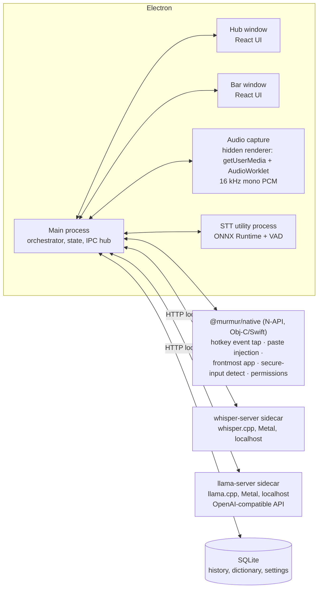

# Murmur — Product & Engineering Plan

**A local-first dictation app for macOS.** Hold a key, speak, release — polished text appears wherever your cursor is. The user experience mirrors Wispr Flow, but every byte of audio and text stays on the machine: speech-to-text and text polishing both run on local models that the user chooses. One hard constraint on that choice: the model catalog is **US-only** — every listed model comes from a US-based organization, enforced by the catalog itself (§8).

> Status: v1.1 — execution in progress.
> Decision log — **2026-08-05**: model catalog restricted to US-origin models only (owner decision). Non-US entries removed; the restriction is enforced by the catalog's origin policy (§8), and even utility models (VAD) comply (§5).

---

## 1. Why this exists

- Company policy forbids cloud dictation tools (Wispr Flow, Superwhisper cloud modes, etc.) because dictated audio/text leaves the machine.
- Existing local tools don't combine all of: Wispr-Flow-grade UX, an LLM "polishing" pass, and model choice inside a compliance-friendly, US-only catalog.
- Goal: a tool an IT/security team can approve at a glance — **no audio, transcript, or telemetry ever leaves the device**. The only network traffic is model downloads, which are user-initiated and auditable, and the app's own update check against GitHub, which is switchable and described in §10.2.

### Goals (v1)

1. System-wide push-to-talk dictation on macOS: hold hotkey → speak → release → text inserted into the frontmost app.
2. Fully local speech-to-text (STT) and local LLM polishing (filler removal, punctuation, formatting, tone).
3. User-selectable models for both stages, from a curated catalog **restricted to models from US-based organizations** (hard policy, §8), each labeled with origin, license, size, and hardware needs — plus "bring your own model" (a GGUF/ONNX file or a local OpenAI-compatible endpoint; imports bypass the catalog and are labeled origin-unverified).
4. Wispr Flow's interface shape: a floating **Bar** (recording pill) + a **Hub** window (history, dictionary, style, settings) + menu-bar presence.
5. Signed, notarized Electron app distributed as a DMG (not Mac App Store — see §16).

### Non-goals (v1)

- Windows/Linux (Electron keeps the door open; macOS-only integrations are isolated behind an interface).
- Mobile, sync, accounts, teams.
- Shipping Windows/Linux **in v1**. Both are now on the roadmap (M7/M8, §4.1) — macOS ships first, and the platform layer is isolated so the ports are additive, not rewrites.
- Real-time streaming captions (arrives in M5 as an upgrade; v1 transcribes on key-release).
- Reusing anything *from* Wispr Flow itself. The UI is a deliberate, close recreation of Flow's (§2), but built entirely from our own code and artwork — nothing extracted from their app bundle, and their name/logo stay out.

---

## 2. UX specification (mirroring Wispr Flow's shape)

Wispr Flow's desktop app lives in two places: the **Flow Bar** (floating pill at the bottom of the screen) and the **Hub** (main window for history/personalization/settings), plus a menu-bar item. Murmur adopts the same triad.

**Fidelity decision:** the UI is a *close copy* of Flow's — same layout, same components, same geometry and motion, recreated by eye from the real product. Two hard limits keep that clean: (1) nothing is ever extracted from Wispr Flow's app bundle — every icon, animation, and stylesheet here is written from scratch; (2) their name and logo are never used — the product is Murmur, with its own mark. Within those limits, matching their look and feel as closely as we can is an explicit goal, not a risk to minimize.

### 2.1 The Bar (floating dictation pill — faithful recreation of the Flow Bar)

The signature element: a small dark capsule floating at the bottom-center of the screen that expands with a live waveform while you speak. Recreate it closely.

**Geometry & look**

- Anchored bottom-center of the display containing the focused window, ~10 px above the screen edge; floats above the Dock and full-screen apps (`screen-saver` window level, all Spaces, `visibleOnFullScreen`).
- Idle: a ~44 × 8 px sliver with a clearly visible outline (`rgba(255,255,255,0.32)`) over a translucent near-black fill — at rest the ring *is* the pill, as in the reference product. It is an indicator, not a control; active states grow to ~12 px, which is enough for the waveform. No backdrop-filter anywhere on this window: in a transparent Electron window it can only sample the window's own (empty) content, so it costs GPU per frame and shows nothing — the glass look comes from gradient sheen layers and a five-layer shadow stack instead.
- **Waking, not swapping.** The active capsule is the resting sliver a little larger, never a different object: it stays translucent (0.80, against the sliver's 0.60), keeps a bright hairline rim, and grows by four pixels rather than ten. The first cut expanded to 148 × 18 with a near-opaque fill and 28 dense bars, and the change of *material* is what made it read as a second widget arriving on top of the first.
- **One size for the whole of the work.** Listening, transcribing and inserting are all 84 × 12. They were 104, 92 and 84, so a two-second dictation resized the capsule four times before it collapsed — each step defensible alone, the sum a pill that fidgeted while you were trying to think. It grows once, holds still, collapses once; only the ✓ is smaller, because by then the work is done.
- **Only the voice moves.** The governing rule for motion. The listening state is a *wave*, not a bar meter: one line, pinned to the centreline at both ends by a half-sine envelope so it emerges from the glass rather than being clipped by it, drifting on a long (~2.6 s) period with a quieter second harmonic riding at its own rate so the crests never repeat into a test signal. At silence every offset is exactly zero — a flat hairline, perfectly still — so a quiet moment mid-dictation costs no motion at all. Bars came first and were the wrong shape: twelve hard-edged rectangles jittering inside a 12 px capsule read as *activity*, when the capsule at rest is a single hairline and a line that bends is the same object moving. The halo's brightness is driven by the live microphone level rather than breathing on a 2.6 s timer of its own. The morph is a pure decelerate, not the overshooting spring it was. Start and stop are the capsule's own rim catching the light, not a ring detaching and flying outward. Before this, six things animated at once during one dictation and none of them meant anything.
- Visibility modes matching Flow: **Show while dictating** (default) · Always show · Hidden (hotkey still works).
- Every state change animates width/opacity over ~180 ms on a pure decelerate — the pill morphs, never jumps or reflows, and never springs past its size and settles back.

**States**

| State | Visual | Trigger |
|---|---|---|
| Idle | small capsule, dim dots | per visibility mode |
| Listening | expands to ~84 px; one continuous line that bends with live mic amplitude at 60 fps, white-on-dark. Silence is a dead-flat hairline — the resting sliver itself — so the pill appears to wake rather than be replaced | hotkey down |
| Hands-free | same + small persistent indicator dot for the latched mode | double-tap hotkey (exit: tap again or Esc) |
| Processing | bars collapse into a left→right shimmer sweep | hotkey up |
| Inserted | quick ✓ pulse, then contracts to idle or hides | text injected |
| Error | warm-red tint, pill expands to fit a short message ("Didn't catch that", "Mic in use", "Secure field — can't type here"), auto-dismiss ~2.5 s | failure |

**Sound**

- A soft two-note cue marks the edges of an utterance: a rising perfect fifth (D4→A4) when listening starts, the same fifth falling (A4→D4) when it stops. ~210 ms, peaking around −16 dBFS, sine only.
- Synthesised at runtime by the hidden capture window (`renderer/audio/cues.ts`), never sampled — the fidelity decision above applies to audio exactly as it does to icons. The pitches, phrasing and envelope were recovered by measuring Flow's cue and fitting the envelope model to it, which is the audible equivalent of recreating the pill's geometry by eye.
- On by default, with an off switch in Settings. It is the only feedback the user gets when the Bar is set to Hidden, which is also the mode where it matters most.

**Interaction**

- Non-activating panel: never steals focus from the app being dictated into.
- Click-through everywhere except the pill itself. **Hovering replaces the pill rather than growing it**, with the reference product's exact arrangement: one row of ~34 px round buttons in the pill's own glass where the pill was — **Dictate · note · mic · Hub** at rest — and a floating capsule *tooltip* above whichever button the pointer is on, naming it ("Dictate `fn`", with the user's real hotkey read from settings). The label is not a control: it takes no clicks and follows the hover. Hands-free swaps the row to **Stop · Discard · mic**; anything else in flight offers **Cancel · mic** only, because there is no "stop and keep" for a physically-held key and a Stop button that quietly meant Cancel would misdescribe what the click does. The row cascades in (~18 ms per button), animates *out* on leave rather than unmounting, and animates transform + opacity only — never `filter` — because animated blur re-rasterises per frame and visibly hitched. Esc still cancels while listening.
  - Clicking **Dictate** starts a hands-free session — a click has no key to hold. It is the first way to start a dictation without the hotkey.
  - Hover is hit-tested against the pill (plus slack) on the way *in* and against a fixed, larger zone on the way *out*: a 10 px target that collapses under the pointer would otherwise flicker between the two states at 60 Hz.
- Follows the active display; optional pin-to-one-display setting.

**Implementation** — one frameless transparent window sized to the largest state; the pill is drawn by the Bar renderer (React + a canvas waveform fed ~30 Hz amplitude frames over IPC, interpolated to 60 fps). No transcript preview in v1; streaming partial text lands in the pill in M5, as in Flow.

### 2.2 The Hub (main window)

Left sidebar navigation, content pane right — Wispr Flow's layout, tracked closely in visual language too: system font (SF Pro), warm neutral light theme + near-black dark theme, large-radius cards, generous whitespace, icon-labeled sidebar items, stats as friendly headline numbers. Sections:

1. **History** — reverse-chronological feed of dictations: polished text (primary), expandable raw transcript, target app name, duration, copy button, delete. Full-text search. (Was "Home"; the headline numbers that used to sit on top of it moved to Insights, where they have room to be more than three numbers.)
1. **Insights** — what the app has actually been used for: average WPM on a dial with a percentile against *published typing speeds* (never against other users — there is no server and therefore no cohort), lifetime words with a month-over-month badge, the three fixes Murmur made that the user did not have to (words cleaned by polishing, dictionary replacements that fired, snippets expanded), a per-app breakdown, and a year-long streak heatmap whose glow ends on the last day actually dictated. Every counter lives outside the retention window — deleting a transcript for privacy does not un-speak it — and only an explicit reset moves them. The per-app tally has its own switch in Settings.
2. **Dictionary** — user-managed vocabulary: proper nouns, jargon, acronyms + optional "replace X with Y" rules (e.g., "murmer → Murmur", "eta → ETA"). Fed to both STT biasing and the polish prompt (§7.4). "Add from correction" flow later (M4).
3. **Style** — tone controls per app category (Personal / Work / Email / Other), mapped from the frontmost app's bundle ID. Options per category: capitalization/punctuation strictness, formality, emoji allowance, filler-word handling. Plus a global "polishing level": Off (raw transcript) / Clean (punctuation, fillers, self-corrections) / Rewrite (tone + structure).
4. **Notes** — the Scratchpad's list: full-text search, pin, rename, delete, "open in window". The floating Scratchpad window itself is opened from the Bar's hover cluster and is where capture happens; this is where a note is found again three weeks later. Notes are *documents*, not history: the retention sweep never touches them.
4. **Vibe coding** — variable recognition and file tagging, with the setup flow for the IDE's own Screen Reader Accessibility Mode and a live "can we read the editor in front right now" check. See §18.3; the section leads with what the feature reads, because it is the one exception to the promise the rest of the app makes.
4. **Models** — the model manager (§8): pick STT model, pick polish model, download/delete, disk usage, origin & license badges (US-only catalog, policy visibly enforced), custom model import, advanced: external OpenAI-compatible endpoint (e.g., company-approved LM Studio/Ollama).
5. **Settings** — hotkey config (default: hold `fn`, like Flow; alternatives Right-⌘/Right-⌥ for external keyboards), double-tap for hands-free, mic selection, language(s), dictation sounds, launch at login, audio retention toggle (default **off** — audio deleted after transcription), history retention window, appearance (system/dark/light).
6. **Help** — permissions status panel (re-check/fix buttons), troubleshooting, logs export (local only).

### 2.2.0 Dashboard

What the Hub opens on. It used to open on History, which is a log — the right thing to have and the wrong thing to land on: it answers "what did I say" for a user who came to ask "is this working", and it has nothing at all to say to someone who has just installed the app and has no history yet.

Four questions, in the order people actually ask them. **Can I dictate right now?** — a readiness hero, first and largest, computed in one place from permissions, engine state and the selected models, naming the one thing in the way and the button that fixes it. The distinction that carries the design is *blocked* versus *degraded*: a denied microphone means dictation cannot work at all, while a missing polishing model means it works and inserts the raw transcript, and rendering those identically trains people to ignore both. **Is it doing anything for me?** — three figures, each a link into the depth behind it. **What is it running?** — both model slots with live engine state, swappable in place among what is already installed (downloading stays in Models, where the size and the licence are on screen next to the button). **What did I just say?** — the last four dictations.

The Dashboard owns no data of its own. Anything you can only do here is something the section it summarises is now missing.

### 2.2.6 Design system

The Hub's shared vocabulary, so that a card built in one section and a card built in another are the same card. Three parts carry it:

**Elevation.** Three rungs — resting (cards and panes), lifted (a pointer target, a popover), overlay (toasts). The two themes reach elevation by different routes and this is the point: in light a surface casts onto the cream, with the shadow tinted warm toward the ink because a neutral grey shadow on a warm ground reads as dirt; in dark there is nothing to cast onto — a black shadow on a near-black canvas is invisible — so elevation is a lit top edge plus a lighter surface. Hence a *surface* scale (sunken / base / raised) alongside the shadow scale: before it existed the content pane and every card inside it were both `#16161b` in dark, and the cards disappeared into the pane. Declared as CSS variables rather than Tailwind `shadow-*` theme values, because Tailwind inlines those into the utility instead of referencing the variable and would freeze the light-theme shadow into both themes.

**Loading and emptiness are different states and look different.** Loading is a skeleton in the shape of what is coming — a list of dictations, a grid of model cards — never a spinner, so the space is already the right size when the content lands. Line lengths vary but are deterministic, seeded off the row index: `Math.random()` in a render reshuffles every line on every re-render. Skeletons keep the announced `role="status"` and label the spinners had, so the swap is a visual upgrade and an accessibility no-op. An empty state is a glyph, a sentence saying what would fill the space, and a button that goes and does it — an empty state with no way out of it is a dead end dressed as an explanation.

**Toasts stack, and some of them are reversible.** Anything can post one, so "Copied", "Saved" and "Removed" stop being invisible. Two identical messages coalesce into one with a count; two *undoable* ones never do, because two deletions are two different undos and merging them would silently discard one. Hovering pauses the countdown — a toast that vanishes while you are reaching for its Undo is worse than no undo. Undo is what replaced the confirmation dialogs on single-row deletes: a modal in front of every delete is the kind of safety that trains people to click through it. Restoring a dictation re-inserts the row and touches no counter, mirroring the delete that never moved them (§9).

### 2.2.8 Command palette

⌘K, and `/` or ⌘F for the search box in any section that has one. The Hub shipped with no keyboard shortcuts at all — not one — which is a strange thing for an app whose entire premise is that reaching for the mouse is the slow part.

Scope is deliberately narrow: it goes places and runs the handful of actions that are one-shot and safe. It does not delete, download or dictate. A palette that can do everything is one you have to read before pressing Enter, and a palette you have to read is slower than the sidebar it replaced.

Ranking is a tiered fuzzy match — prefix beats substring beats subsequence — with word-boundary credit so initials work ("vc" finds Vibe coding). A keyword match is worth exactly half a title match, which is a whole tier: "notes" finds Scratchpad, but never above a command actually called Notes.

### 2.3 Menu bar

Template icon (mic glyph; subtle state change while listening). Menu: Open Hub · Start hands-free dictation · Mic picker · Language · Pause Murmur · Quit. No Dock icon by default (`LSUIElement`), toggleable.

### 2.4 Onboarding (first run)

1. Welcome → 2. **Microphone** permission → 3. **Accessibility** permission (for text insertion) → 4. **Input Monitoring** permission (for the global hotkey) → 5. Pick + download a starter model pair with disk-size shown (offer a "smallest" and "recommended" bundle) → 6. Interactive tutorial: "hold `fn` and say *testing one two three*" into a practice text field → 7. Done; note about macOS's built-in double-fn dictation conflict with a one-click "open Keyboard settings" to disable it.

Each permission screen shows exactly why it's needed and what is *not* done (no keylogging — the tap listens only for the configured hotkey; no screen reading). The last of those is now conditional and must be stated as such: **Murmur reads no screen content unless the user switches on Vibe coding's variable recognition**, which is off by default, is scoped to three IDE bundle ids, stores nothing, and is described in full in §18.3. Help carries a live row saying which of the two states the app is currently in.

---

## 3. System architecture

Electron app + native glue + local inference sidecars. The renderer never touches models, audio devices are read in one place, and inference runs outside the Electron main process so the UI never jitters.



### 3.1 Process roles

- **Main process** — the state machine (idle → listening → transcribing → polishing → inserting), window/tray management, model lifecycle, settings, SQLite. Typed IPC contract shared with renderers.
- **Hub / Bar windows** — plain React; no Node integration, context-isolated, talk over typed IPC only.
- **Audio capture** — a hidden renderer using `getUserMedia` + `AudioWorklet` downsampling to 16 kHz mono Float32 frames streamed to main via IPC. Renderer-side capture avoids native audio code and gets device-picker + level metering for free. (If latency or reliability disappoints, fallback plan: AVAudioEngine in `@murmur/native`.)
- **STT utility process** — Electron `utilityProcess` hosting **ONNX Runtime** (`onnxruntime-node`, Microsoft) for ONNX models (Parakeet, Moonshine, NVIDIA NeMo streaming models) plus the VAD stage (§5). The thin decode loops are our own code (§6.1). Keeps models resident between utterances; crash-isolated and restartable.
- **whisper-server sidecar** — bundled `whisper.cpp` server binary (Metal + Core ML on Apple Silicon) for the Whisper family. Spawned on demand, bound to `127.0.0.1` on a random port with a per-session auth token; model stays loaded between utterances.
- **llama-server sidecar** — bundled `llama.cpp` server (Metal) exposing the OpenAI-compatible chat API for the polishing pass. Because polishing already speaks OpenAI-compatible HTTP, "use an external local endpoint" (Ollama / LM Studio / company-hosted vLLM) is the same code path with a different base URL.
- **`@murmur/native`** — one small N-API module (Obj-C/Swift) for everything Electron can't do: CGEventTap hotkey listening (incl. the `fn` key via `flagsChanged`), paste injection, frontmost-app lookup, secure-input detection, permission checks/prompts. Detailed in §4.

### 3.2 The dictation loop (happy path)

1. Native tap reports hotkey-down → main enters *listening*, shows Bar, starts audio capture.
2. Hotkey-up → stop capture, VAD-trim the buffer, show *processing*.
3. Buffer → active STT engine (utility process or whisper-server) → raw transcript.
4. Dictionary replacements applied; if polishing is on → llama-server with the tone profile for the frontmost app's category → polished text. (Utterances under ~3 words skip polish by default — not worth the latency.)
5. Injection: save clipboard → set clipboard to text → synthetic ⌘V via native module → restore clipboard (~150 ms later). Fallback: AX `AXUIElement` insertion for apps that block synthetic keystrokes; if the focused field has **secure input** enabled (password fields), refuse with a Bar error instead of typing.
6. Persist history row (raw + polished + app + timings), update stats, hide Bar.

Cancel paths: Esc during listening; empty/silent audio → "No speech detected"; every stage has a timeout that surfaces a Bar error rather than hanging.

---

## 4. macOS integration details (the hard, load-bearing part)

| Concern | Approach | Permission |
|---|---|---|
| Global hold-to-talk hotkey, incl. `fn` | `CGEventTap` (listen-only) for `keyDown/keyUp/flagsChanged`; `fn` arrives as `flagsChanged` with `.maskSecondaryFn`. Debounce; double-tap detection for hands-free. Electron's `globalShortcut` cannot do key-up or `fn`, hence native. | Input Monitoring |
| Text insertion | Clipboard-swap + synthetic ⌘V (`CGEventPost`), the same technique Flow-class apps use; AX insertion fallback; never type into secure input (`IsSecureEventInputEnabled` check). | Accessibility |
| Frontmost app (for tone category + history) | `NSWorkspace.frontmostApplication` bundle ID, display name and pid. No window titles, no screen content. | none |
| Code context (Vibe coding, §18.3) | **Opt-in, off by default.** `kAXValueAttribute` of the focused element, capped at 20k chars, **only** when the frontmost bundle id is VS Code, Cursor or Windsurf. Secure fields refused. Identifiers extracted in memory, cached for seconds, never stored or logged. This is the one place Murmur reads screen content, and every gate on it lives in `code-context.ts`. | Accessibility |
| Mic capture | `getUserMedia` in hidden renderer; `com.apple.security.device.audio-input` entitlement + `NSMicrophoneUsageDescription`. | Microphone |
| Permission UX | `AXIsProcessTrustedWithOptions`, `CGPreflightListenEventAccess`/`CGRequestListenEventAccess`, `AVCaptureDevice.authorizationStatus` — surfaced in onboarding + Help panel with deep links into System Settings panes. | — |
| Conflict: macOS built-in dictation on double-`fn` | Detect setting, warn during onboarding, link to Keyboard settings. | — |
| Bar window | Frameless, transparent, `screen-saver` level, all-Spaces + `visibleOnFullScreen`, non-activating panel behavior, click-through except controls. | — |

Prototype-stage shortcut: `uiohook-napi` can stand in for the event tap during M1 development, but the plan of record is our own tap in `@murmur/native` — `fn` handling, key *suppression* while dictating (so hold-`fn` doesn't also trigger app shortcuts), and double-tap timing all want first-party control.

Bundled sidecar binaries (`whisper-server`, `llama-server`) are compiled in CI for arm64 + x86_64, code-signed with hardened runtime, and shipped inside `Contents/Resources/bin/` (notarization requirement — see §16 risks).

### 4.1 Windows & Linux ports (M7 landed; M8 X11 landed, Wayland outstanding)

Only `@murmur/native` and packaging are per-OS; the inference stack, Electron shell, and the entire Hub/Bar UI are already cross-platform. A port implements this table plus an installer — nothing else changes:

| Concern | Windows (M7) | Linux (M8, best-effort) |
|---|---|---|
| Hold-to-talk hotkey | low-level keyboard hook (`SetWindowsHookEx` WH_KEYBOARD_LL) in the native module, with key suppression | X11: **XRecord** (shipped, not the XGrabKey planned here — see below); Wayland: GlobalShortcuts portal where the compositor supports it |
| Text insertion | clipboard swap + `SendInput` Ctrl+V; UI Automation fallback | X11: XTEST Ctrl+V; Wayland: virtual-keyboard protocol, else clipboard-assist mode |
| Frontmost app (tone category) | `GetForegroundWindow` → process name | X11: `_NET_ACTIVE_WINDOW`; Wayland: often unavailable → falls back to the global default tone |
| GPU acceleration | llama.cpp/whisper.cpp Vulkan (or CUDA) builds; CPU int8 STT via ONNX Runtime | same (Vulkan/CPU) |
| OS permissions | none beyond the mic privacy toggle | none |
| Tray + Bar | system tray; Bar works as-is | StatusNotifier tray; Bar solid on X11, per-compositor on Wayland |
| Packaging | signed NSIS installer + winget manifest + auto-update | AppImage + .deb + Flatpak |

Sequencing: Windows right after macOS v1.0 (well-trodden mechanics). Linux last and explicitly best-effort — Wayland fragments global hotkeys and synthetic paste across compositors, so Linux ships X11-first with a published Wayland support matrix.

**Deviation, Linux hotkey: XRecord, not XGrabKey.** The row above planned an XGrabKey grab so the key could be suppressed the way the mac tap and the Windows hook suppress theirs. That is unworkable for the presets we actually ship. Murmur's hotkeys are bare modifiers (Right Ctrl by default), and an XGrabKey grab on a modifier takes that key *exclusively* — Right Ctrl would stop working as Ctrl in every other application for as long as Murmur runs. XRecord observes the key without stealing it, at the cost of being unable to swallow anything. Two consequences are load-bearing and documented where a user meets them (`packages/native/src/linux/`, `LINUX-HANDOFF.md`, the README): Caps Lock and the Space chords are not offered as Linux presets, because both need suppression to behave; and `isSecureInputActive` reports false, because the only X11 probe for it would mean grabbing the keyboard away from the password dialog it is trying to detect.

---

## 5. Audio pipeline

- Format: 16 kHz mono Float32 (what every candidate STT model wants). Downsample in an `AudioWorklet`; ship ~100 ms frames over IPC.
- Pre-roll ring buffer: capture starts *on hotkey-down*, but keep a ~300 ms rolling pre-buffer once the mic stream is warm so first syllables aren't clipped; mic stream is opened lazily on first dictation and kept warm for a configurable idle window (default 5 min) to avoid cold-start latency.
- **VAD (no-ML, policy-clean)**: an energy/spectral gate in the WebRTC-VAD lineage, implemented in-process — trims leading/trailing silence before STT and segments meeting capture; hard cap per-utterance length (default 5 min, configurable). It deliberately does **not** end a hands-free session: silence is a pause for thought, not a decision to stop, and §2.1 promises the user ends the mode themselves (tap again or Esc). Deliberately *not* Silero VAD (non-US origin): the US-only policy holds even for utility models.
- Echo/noise: rely on macOS voice-processing input (`echoCancellation: true` constraint) — good enough v1; revisit if AirPods/laptop-mic feedback complaints appear.
- Audio is held in memory only and discarded after transcription unless the user opts into retention (§10).

---

## 6. Speech-to-text layer

### 6.1 Engine abstraction

```ts
interface SttEngine {
  id: string;                       // "whisper-cpp" | "onnx-runtime" | future
  load(model: ModelRef, opts: SttOptions): Promise<void>;   // model stays resident
  transcribe(pcm: Float32Array, opts: UtteranceOpts): Promise<Transcript>;
  transcribeStreaming?(frames: AsyncIterable<Float32Array>): AsyncIterable<PartialTranscript>; // M5
  unload(): Promise<void>;
}
```

Two engines cover the whole catalog:

| Engine | Runs | Why |
|---|---|---|
| **ONNX Runtime** (`onnxruntime-node`, Microsoft — in the utility process) | Parakeet (NVIDIA's own NeMo→ONNX export), Moonshine (official ONNX release), NeMo streaming models (M5) | US-governed runtime; CPU int8 is real-time on any Mac; the decode loops (TDT greedy decode, ~200 lines) are our code, validated against NVIDIA reference transcripts |
| **whisper.cpp** (`whisper-server` sidecar) | Whisper family (large-v3-turbo, distil, quantized) | Best Whisper performance on Apple Silicon (Metal + Core ML encoder); Whisper remains the multilingual quality bar |

A possible third path — **audio-LLMs via llama.cpp** — is deferred until a US-origin audio-LLM matures in local runtimes (§6.3).

### 6.2 Curated STT catalog (v1) — US-origin only

Only models from US-based organizations are listed. The picker still shows **origin, license, size, languages, engine** for every entry so the policy is auditable at a glance. Sizes are quantized on-disk estimates.

| Model | Origin | License | Disk | Languages | Engine | Notes |
|---|---|---|---|---|---|---|
| **Parakeet-TDT 0.6B v3** (NVIDIA) | 🇺🇸 US | CC-BY-4.0 | ~650 MB int8 | en + 24 European langs | onnx-runtime | Fastest high-accuracy option; **recommended default** |
| **Parakeet-TDT 0.6B v2** (NVIDIA) | 🇺🇸 US | CC-BY-4.0 | ~650 MB int8 | en | onnx-runtime | English-only alternative |
| **Whisper large-v3-turbo** (OpenAI) | 🇺🇸 US | MIT | ~1.6 GB q5 | ~100 languages | whisper.cpp | Multilingual quality bar |
| **Whisper small.en / tiny.en** (OpenAI) | 🇺🇸 US | MIT | 75–500 MB | en | whisper.cpp | Low-RAM fallback; small.en is the M1 bring-up model |
| **Distil-Whisper large-v3.5** (Hugging Face, NYC) | 🇺🇸 US | MIT | ~750 MB | en | whisper.cpp | ~2× Whisper-large speed at near-parity accuracy |
| **Moonshine base** (Useful Sensors) | 🇺🇸 US | MIT | ~60 MB | en | onnx-runtime | Tiny; old-Intel-Mac tier |

Watch list (US-origin, add when a local ONNX/GGML runtime path is proven; the catalog is a signed JSON file the app can update without a release, §8): NVIDIA Canary / Canary-Qwen, IBM Granite Speech.

Removed by policy (previously listed): SenseVoice, Paraformer, FireRedASR (🇨🇳); Voxtral, Kyutai STT (🇫🇷); Cohere ASR (🇨🇦). The catalog's origin allowlist (§8) is what keeps them out — not just this document.

**Recommended defaults:** 8 GB Mac → Whisper small.en or Moonshine; 16 GB+ → Parakeet v3 (speed) or Whisper large-v3-turbo (multilingual).

### 6.3 Audio-LLM combo mode (deferred)

A single audio-LLM doing transcription **and** polishing in one pass stays architecturally attractive (one model, one latency budget), and the llama-server sidecar already provides the plumbing. Deferred because the strong open audio-LLMs today are non-US-origin and therefore out of policy. Revisit if a US-origin option (e.g., the Ultravox line) matures with solid llama.cpp support.

### 6.4 Accuracy aids

- **Dictionary biasing**: Whisper receives dictionary terms via `initial_prompt`; on the ONNX Runtime path (Parakeet/Moonshine) biasing is post-STT for now — replacement rules plus the polish prompt fix casing and spelling — with shallow-fusion hotword biasing on the backlog (§18).
- **Post-STT replacement rules** from the Dictionary run before polishing.
- Language: manual selection in v1 (auto-detect only where the model does it natively, e.g. Whisper/SenseVoice); per-language model routing later.

---

## 7. Polishing layer (local LLM)

### 7.1 Engine

`llama-server` (llama.cpp) sidecar with the OpenAI-compatible `/v1/chat/completions` API. Model resident between utterances; unloadable after idle timeout (configurable) to release RAM. Alternative backend = any OpenAI-compatible **local** URL (Ollama, LM Studio, company vLLM box) — same client code; the app warns if the endpoint isn't loopback/RFC-1918 so "local-only" stays honest.

### 7.2 Curated polish-model catalog (v1) — US-origin only

Task profile: short-input, short-output rewriting — needs instruction-following and speed, not reasoning. Small models excel here.

| Model | Origin | License | Disk (Q4) | RAM tier | Notes |
|---|---|---|---|---|---|
| **Gemma 3 4B-it** (Google) | 🇺🇸 US | Gemma license | ~2.6 GB | 16 GB | **Recommended default** — best small-model rewriting quality |
| **Gemma 3 1B-it** (Google) | 🇺🇸 US | Gemma license | ~800 MB | 8 GB | Low-RAM default |
| **Phi-4-mini-instruct 3.8B** (Microsoft) | 🇺🇸 US | MIT | ~2.4 GB | 16 GB | MIT — cleanest license for strict environments |
| **Llama 3.2 3B / 1B Instruct** (Meta) | 🇺🇸 US | Llama license | 0.8–2 GB | 8–16 GB | Ubiquitous, well-tested quants |
| **OLMo 2 7B Instruct** (Allen Institute for AI) | 🇺🇸 US | Apache-2.0 | ~4.5 GB | 16 GB+ | Fully open (data + weights) — easiest compliance story |
| **Granite 3.3 2B / 8B Instruct** (IBM) | 🇺🇸 US | Apache-2.0 | 1.5–5 GB | 8–16 GB | Enterprise-friendly |
| *Bring your own GGUF* | — | — | — | — | File picker or HF repo ID; labeled origin-unverified |

Removed by policy (previously listed): Qwen3, GLM-Edge (🇨🇳); Mistral/Ministral (🇫🇷); EuroLLM (🇪🇺); Falcon (🇦🇪).

(Exact SKUs re-verified when the catalog file is authored — small-model releases move monthly; catalog updates don't require app releases, §8.)

### 7.3 Latency budget (hotkey-up → text inserted, 5 s utterance, M-series 16 GB)

| Stage | Target |
|---|---|
| VAD trim + transfer | < 50 ms |
| STT (Parakeet/SenseVoice int8) | 150–500 ms |
| STT (Whisper turbo, Metal) | 500–1000 ms |
| Polish (Gemma 3 1B/4B Q4, ~50 tok out) | 300–800 ms |
| Injection | < 100 ms |
| **End-to-end target** | **≤ 1.5 s typical, ≤ 2.5 s with Whisper turbo** |

Tricks: skip polish for ≤3-word utterances; cap polish output tokens relative to input length; keep both models resident; warm the llama context with the system prompt (prompt caching) so per-utterance prompt processing is minimal; thinking-mode models always run with thinking off.

### 7.4 Polish prompt design

System prompt assembled per utterance from: polishing level (Clean/Rewrite), tone profile for the frontmost app category, dictionary terms, output-language rule ("reply in the transcript's language"), and hard rules: *never answer questions, never add content, never translate — you are a transcription editor, output only the edited text.* Few-shot examples ship per polishing level. Self-correction handling ("send it Tuesday — no wait, Wednesday" → "send it Wednesday") is the marquee Clean-level behavior and gets its own eval set (§13.4). Numbered/bulleted list detection ("one… two… three…" → markdown list) at Rewrite level, matching Flow's auto-formatting.

Guardrail: if polish output diverges wildly in length from input (hallucination guard), fall back to the raw transcript and log it (locally).

---

## 8. Model manager

- **Catalog** = a versioned, signed JSON file shipped with the app (updatable independently of app releases): model metadata, origin, license, quant variants, SHA-256 checksums, download URLs with mirrors.
- **Sources**: Hugging Face only; all downloads resumable, checksum-verified, into `~/Library/Application Support/Murmur/models/`.
- UI: per-model card (origin flag, license, disk, RAM tier, languages), download progress, delete, "active" markers for the current STT/polish pair, total disk usage.
- **Origin policy (enforced, not advisory)**: every catalog entry carries an `origin` field and the catalog carries an `originPolicy` allowlist, compiled into the app as `["US"]`. Entries failing the allowlist are rejected at catalog load — a mirrored or hand-edited catalog can't smuggle a non-US model into the picker.
- **Custom models**: local file import (GGUF for polish/whisper.cpp; ONNX bundle for the ONNX Runtime engine) or HF repo reference; these bypass the catalog by definition and are clearly labeled "user-supplied — origin unverified".
- Hardware advisor: detect chip + RAM (`systemProfiler`/`os` APIs), badge each model *Runs well / Tight / Not recommended*.

---

## 9. Data model (SQLite via better-sqlite3, WAL mode)

- `dictations(id, ts, raw_text, polished_text, app_bundle_id, app_name, app_category, duration_ms, stt_model, polish_model, timings_json)` + FTS5 index on both text columns.
- `lifetime_stats(id=1, total_words, timed_words, spoken_ms, dictionary_fixes, snippet_expansions, words_cleaned)` and `dictation_days(day, words, dictations, spoken_ms)` — the counters behind Home's numbers and the Insights section. **Deliberately outside the retention sweep**: derived from the rows, they would fall every time the sweep ran, which is a picture of the retention window rather than of the user.
- `app_usage(bundle_id, display_name, category, words, dictations, spoken_ms, last_used_at)` — the Insights breakdown. Gated by `settings.insightsEnabled`; zeroed with the rest by "Reset insights".
- `notes(id, title, body, created_at, updated_at, pinned)` + FTS5 on title and body — the Scratchpad. The one text table with **no retention policy at all**: a note is a document the user wrote, not a record of something that happened.
- `dictionary(id, term, replacement NULL, enabled)` — NULL replacement = vocabulary-boost-only term.
- `style_profiles(category, formality, fillers, emoji, level, custom_instructions)`.
- `settings(key, value)` — hotkey, models, mic, language, retention, etc.
- Optional `audio/` folder (only when retention opted in), files named by dictation id, auto-pruned by retention window.
- Everything under `~/Library/Application Support/Murmur/`; "Export my data" (JSON/CSV) and "Delete everything" buttons in Settings.

---

## 10. Privacy & security posture (the selling point — make it auditable)

1. **No telemetry, no analytics, no accounts, no crash uploads.** Crash reports write to local disk; the user chooses whether to share them.
2. Network access happens **only** for: model catalog refresh + model downloads (user-initiated, to Hugging Face) and the update check against this project's own GitHub releases. The update check is the **one** request nobody presses a button for — it runs shortly after launch and every six hours, and fetches the installer when `settings.updates.autoDownload` is on. It reveals the machine's IP, the running version and roughly when it is awake, and nothing else; both halves are switchable in Settings › Updates, and Help's Network activity row states which is currently on rather than making a blanket promise. Everything else is enforced in code by a single fetch wrapper with an allowlist, and documented so IT can verify with Little Snitch/proxy logs.
   - *Changed in 0.4.8, deliberately.* v1 shipped this off by default on the reasoning that a background poll is traffic nobody agreed to. That is true, and it was still the wrong trade: the users who sit furthest behind are exactly the ones who never open Help to press Check, and every fix reaches them through this path. The honest answer was not to avoid the request but to name it — which is why the copy above is specific about what it discloses instead of reassuring.
3. Sidecars bind to `127.0.0.1` with a random port + bearer token generated per launch (no other local user/process can use our inference servers or read prompts).
4. Audio in memory only by default; history is local SQLite; both retention windows user-controlled.
5. The event tap is **listen-only for the configured hotkey** — key events other than the hotkey are never logged, buffered, or transmitted; this is stated in-app and verifiable in source.
6. Open-sourcing this repo (MIT) is the credibility multiplier for corporate approval — recommended.
7. Signed + notarized builds; SBOM generated in CI for supply-chain review.

---

### 10.5 Getting your data out

The local-first promise has a hole in it if your dictations cannot leave your machine *when you want them to*: data you can only read inside one app is not really yours. Export is the other half of the argument, not a nice-to-have.

Four routes out. History as Markdown, CSV, JSON or plain text; notes as one Markdown file each with their dates in front matter, so the result is useful in Obsidian or a git repo; and a full backup — dictionary, snippets, notes, settings, and optionally the transcripts — as a single versioned JSON file. Restore is the fourth, and it is the only operation here that touches data already on the machine, so it is two steps: the file is read and summarised, and nothing is written until the user has seen what is in it.

Every restore preserves the original ids, which makes it idempotent: the same backup applied twice is the same database, and anything the user has edited since is left as they edited it rather than being reverted by an older file. The lifetime Insights counters are deliberately *not* in a backup, and the UI says so.

Two details that are easy to get wrong and were therefore tested first. CSV fields are RFC 4180 — dictated prose contains commas constantly, quotation marks often, and newlines whenever someone dictated a list — and a field beginning `=`, `+`, `-` or `@` is prefixed with an apostrophe, because a spreadsheet treats those as the start of a formula. Note filenames are sanitised for Windows, reserved device names (`con`, `lpt1`) included, and de-duplicated case-insensitively before anything is written.

## 11. Tech stack

| Layer | Choice | Rationale |
|---|---|---|
| Shell | **Electron 3x + TypeScript** | Requirement; mature tray/multi-window/utilityProcess support |
| Bundler/scaffold | **electron-vite** | Fast HMR for three renderer targets (Hub, Bar, audio) |
| UI | **React + Tailwind + Radix primitives** | Fast to build a polished Hub; Bar is a tiny standalone bundle |
| State | zustand (renderer) + main-process store as source of truth over typed IPC | One writer, many readers |
| IPC | Hand-rolled typed contract (zod-validated) | Small surface; avoids preload sprawl |
| DB | better-sqlite3 + FTS5 | Sync, fast, battle-tested in Electron |
| STT | ONNX Runtime (`onnxruntime-node`, Microsoft) + whisper.cpp server sidecar | §6 |
| LLM | llama.cpp server sidecar (OpenAI-compatible) | §7 |
| Native | `@murmur/native` N-API module (Obj-C/Swift, node-gyp) | §4 |
| Packaging | electron-builder → signed/notarized DMG, universal (arm64 + x64) | Direct distribution |
| CI | GitHub Actions (macos-14 arm64 + macos-13 x64): lint, typecheck, unit, sidecar builds, e2e smoke (Playwright), package + notarize on tag | Reproducible sidecar binaries |
| Testing | vitest (unit) · Playwright for Electron (UI) · golden-file evals for polish prompts (§13.4) · recorded-audio fixture suite for STT wiring | |

### 11.1 Software provenance & the strict-US fallback

Model origin is policy-clean by construction (§8). For reviewers who extend the bar to *software governance*:

| Component | Governance | Status |
|---|---|---|
| Electron / Chromium / Node, React, ONNX Runtime, better-sqlite3 | US foundations & corporations (OpenJS, Google, Meta, Microsoft) | clean |
| whisper.cpp / llama.cpp | MIT-licensed community OSS led by an EU-based maintainer — no foreign *corporate* governance; we vendor, version-pin, and compile from source in CI with SBOM | disclosed up front; typically passes license+SBOM review |
| sherpa-onnx (Xiaomi-affiliated, CN) | — | **removed from the product** (2026-08-05) |

If review rejects EU-community-led OSS outright, the fallback is pre-wired because every engine sits behind an interface: STT consolidates fully onto ONNX Runtime (Microsoft publishes optimized Whisper ONNX builds — whisper.cpp retires), and polishing swaps the llama.cpp sidecar for an **ONNX Runtime GenAI** sidecar running Microsoft's official Phi-4-mini ONNX build, with **Apple MLX** (Apple-governed, Metal-fast) evaluated as the Mac performance path. That stack is US-corporate-governed end to end; its cost is polish latency on CPU (start with 1B-class defaults until the MLX path lands), measured against the M5 bench before committing.

Prior art to study/borrow from (all open source, all validate feasibility): **VoiceInk** (macOS native, whisper.cpp local dictation), **Handy** (cross-platform Tauri push-to-talk), **Vibe** (whisper transcription UI). Murmur's differentiators: Flow-grade UX + polish stage + model choice with origin labeling.

---

## 12. Repository layout

```
murmur/
├── PLAN.md                     # this document
├── package.json                # workspaces
├── apps/desktop/               # the Electron app
│   ├── src/main/               # main process: state machine, windows, tray,
│   │   ├── dictation/          #   loop orchestrator, injection, audio broker
│   │   ├── engines/            #   SttEngine/PolishEngine impls, sidecar mgmt
│   │   ├── models/             #   catalog, downloads, storage
│   │   ├── store/              #   sqlite, settings, history, dictionary
│   │   └── ipc/                #   typed contract
│   ├── src/preload/
│   ├── src/renderer/hub/       # React app: Home, Dictionary, Style, Models, Settings, Help
│   ├── src/renderer/bar/       # the pill
│   ├── src/renderer/audio/     # hidden capture page + AudioWorklet
│   └── electron-builder.yml
├── packages/native/            # @murmur/native N-API module (Obj-C/Swift)
├── packages/shared/            # types, IPC schema, catalog schema
├── resources/catalog/          # models.json (+ signing)
├── scripts/sidecars/           # build whisper.cpp / llama.cpp universal binaries
└── .github/workflows/
```

---

## 13. Roadmap

Milestones are demoable slices; each has acceptance criteria. Rough calendar assumes one focused developer; halve wall-clock with two.

### M0 — Foundations (week 1)
Scaffold (electron-vite, workspaces, TS strict), tray + empty Hub/Bar windows, typed IPC skeleton, CI (lint/typecheck/test on mac runners), signing certs wired, sidecar build scripts producing signed universal `whisper-server`/`llama-server`.
**Accept:** `npm run dev` shows tray + windows; CI green; notarized empty-shell DMG installs and launches on a clean Mac.

### M1 — Core dictation loop (weeks 2–4) ← *the risk burn-down milestone*
`@murmur/native` v0 (event tap: hold-`fn` + one alternate key, permissions API, paste injection, secure-input detect), audio capture renderer, VAD, whisper.cpp path with a small Whisper model, Bar with listening/processing/inserted/error states, onboarding flow with the three permissions, history rows written.
**Accept:** on a clean machine, onboarding → hold `fn`, speak 5 s, release → correct text lands in Notes/Slack/Chrome/Terminal in ≤ 2.5 s; secure fields refused gracefully; Esc cancels; survives display sleep and app relaunch.

### M2 — Model manager + engine abstraction (weeks 5–6)
ONNX Runtime utility process (Parakeet + Moonshine; TDT greedy decode validated against NVIDIA reference transcripts), catalog JSON + downloader (resume, SHA-256), Models UI with origin/license badges and visible US-only policy enforcement, hardware advisor, STT model switching without restart, language selection, mic picker, launch-at-login, hotkey customization UI.
**Accept:** fresh install reaches Parakeet or Whisper turbo in two clicks; a tampered catalog containing a non-US entry is rejected with a visible error; model switch < 10 s; downloads survive network drops.

### M3 — Polishing (weeks 7–8)
llama-server sidecar + lifecycle (idle unload), polish pipeline with levels Off/Clean/Rewrite, prompt assembly (tone per app category, dictionary, few-shots), Style UI, Dictionary UI + STT hotword/initial-prompt biasing + replacement rules, external OpenAI-compatible endpoint option, hallucination guard, ≤3-word skip rule.
**Accept:** "um so basically we should uh ship it on on tuesday no wednesday" → "We should ship it on Wednesday." via Gemma 3 4B in ≤ 800 ms added latency; polish eval suite (§13.4) ≥ 90% pass; raw-transcript fallback observable.

### M4 — History, stats, personalization depth (weeks 9–10)
Hub Home with search (FTS5), copy/delete, stats (words, WPM, streak), per-app category mapping UI, audio retention opt-in + auto-prune, data export/delete-all, Help panel with permission re-checks, polish pass over visual design.
**Accept:** 1k-row history searches < 50 ms; stats match hand-computed fixtures; export produces valid JSON/CSV.

### M5 — Latency & streaming upgrades (weeks 11–12)
Streaming STT (NVIDIA NeMo streaming models on ONNX Runtime; evaluate Moonshine's streaming mode) with live partial text in the Bar, hands-free double-tap mode, prompt caching for polish, Intel-Mac performance pass.
**Accept:** perceived latency (release → text) ≤ 1 s with streaming pipeline on M-series; hands-free dictates three consecutive utterances without touching the keyboard, pauses between them included — the session ends on the user's tap, not on silence.

### M6 — Distribution & easy install (week 13)
Release automation: tag → CI builds, signs, notarizes, staples, and publishes the universal DMG to **GitHub Releases** with SHA-256 checksums; auto-update via electron-updater with beta→stable channels (opt-in, off by default for corporate installs); **Homebrew cask** (`brew install --cask murmur`); a one-page **download site** (GitHub Pages) with an OS-detecting download button, checksums, and the IT one-pager (network/telemetry statement) linked; SBOM, user docs, license audit of bundled components, v1.0 tag.
**Accept:** a coworker with the link is dictating in < 5 min including model download, with no Gatekeeper warnings (notarized build); update flow verified; all bundled licenses documented.

### M7 — Windows port (post-1.0)
`@murmur/native` win32 backend (low-level keyboard hook, SendInput paste, foreground-app lookup), Vulkan/CPU sidecar builds, NSIS installer + Authenticode signing + winget manifest, Windows CI leg, QA matrix (Win 10/11).
**Accept:** M1-parity on Windows 11 — hold-key → text lands in Notepad/Teams/Chrome in ≤ 2.5 s; installer, auto-update, and download page verified.

### M8 — Linux port (post-1.0, best-effort) — X11 landed, unproven on hardware
X11 backend (XRecord + XTEST — see the deviation in §4.1), AppImage/.deb packaging, Wayland detected and reported rather than silently failing.
**Accept:** M1-parity on Ubuntu LTS under X11; Wayland matrix published with per-compositor status.
**Where it stands:** the backend compiles and loads in CI on every push and the installers build, but no dictation has been driven end-to-end on real Linux hardware — the acceptance above is *not* met yet. Flatpak, the StatusNotifier tray and the Wayland matrix are all still outstanding. [LINUX-HANDOFF.md](./LINUX-HANDOFF.md) is the queue.

### 13.4 Evals (built alongside M3, run in CI)
- **Polish golden set**: ~150 transcript → expected-output pairs per level (fillers, self-corrections, lists, emails, mixed-language), scored by exact/fuzzy match; run against every catalog polish model in a nightly job on a self-hosted Apple Silicon runner.
- **STT wiring set**: ~20 recorded WAV fixtures (accents, jargon from Dictionary, silence, 30 s ramble) asserting WER bounds per engine — catches integration regressions, not model quality.
- **Latency bench**: scripted loop reporting p50/p95 per stage per model tier; regression gate ±20%.

---

## 14. Performance targets & hardware tiers

| Tier | Machines | STT default | Polish default | Expected e2e (5 s utterance) |
|---|---|---|---|---|
| A | Apple Silicon ≥ 16 GB | Parakeet v3 / Whisper turbo | Gemma 3 4B Q4 | ≤ 1.5 s |
| B | Apple Silicon 8 GB | Whisper small.en / Moonshine | Gemma 3 1B Q4 (or polish Off) | ≤ 2 s |
| C | Intel Macs | Moonshine / Whisper tiny.en | polish Off by default | ≤ 3 s, best-effort |

RAM guardrail: warn before loading a combo whose working set exceeds ~60% of physical RAM; auto-unload polish model after idle.

---

## 15. Production readiness — definition of done & quality gates

The roadmap says what gets built; this section says when it is allowed to be called production. v1.0 does not ship until every box here is checked.

### 15.1 Reliability
- 48-hour soak on real hardware: app resident with regular dictations; zero crashes; main-process RSS stable (< 150 MB idle, models excluded); no listener/child-process leaks (counted before/after).
- Sidecar watchdog: a whisper/llama server exit triggers auto-restart with exponential backoff; surfaced to the user only after 3 consecutive failures; the state machine returns to a safe idle on every failure path — no dead ends, asserted by unit tests over the full transition table.
- Every stage of the dictation loop has a timeout and a user-visible error state; no silent hangs anywhere.
- Survives (manual QA script + automated where possible): sleep/wake mid-dictation, display hot-plug and resolution change, mic hot-swap (AirPods connecting/disconnecting while listening), Space switches and full-screen transitions, fast user switching, app relaunch while a model download is in flight.

### 15.2 Data safety
- SQLite in WAL mode; integrity check at boot; corrupt DB → timestamped backup + clean re-init, never a crash loop.
- Atomic settings writes (temp file + rename); versioned forward-only migrations with automatic pre-migration backup.
- Downloads land in temp files renamed only after checksum verification; partials are resumed or reaped; a checksum failure quarantines the file with a visible error.

### 15.3 Security & privacy (verified, not asserted)
- An integration test asserts the app contacts no host other than the Hugging Face download hosts (plus the update host when enabled) — run in CI behind a recording proxy.
- Sidecars: loopback bind + per-launch bearer token, both covered by tests; the token is never logged.
- IPC: every channel zod-validated at the boundary; renderer input treated as untrusted; no renderer-supplied file path reaches disk without normalization + allowlist (the downloader and model-import paths are the sensitive ones).
- Logs redact transcript content by default (verbose local debugging is opt-in); no analytics of any kind; `npm audit`/osv-scanner clean or explicitly waived in-repo; SBOM per release.

### 15.4 Release engineering
- CI on every PR: typecheck, lint, unit suite, main+renderer builds, and a Playwright smoke test (launch with the stubbed native layer → simulated dictation → Bar state assertions → history row written).
- Nightly on a self-hosted Apple Silicon runner: model-in-the-loop polish evals (§13.4) and the latency bench with a ±20% regression gate.
- Tagged releases: universal (arm64 + x86_64) build including sidecars and the native module, Developer ID signing, notarization + stapling, DMG + SBOM + CHANGELOG published together; the previous DMG is retained as the rollback path; auto-update ships to a beta channel before stable.
- Crash handling: local minidumps with per-release symbolication assets archived (no automatic upload — privacy posture, §10).

### 15.5 UX & accessibility bar
- VoiceOver labels and full keyboard navigation across the Hub; the Bar respects Reduce Motion; dark/light parity audit; text scaling 100–200%; a copy pass over every user-facing string — every error message names a next action.

### 15.6 Execution quality gates (how the code gets written)
- Every implementation stage lands only with install + typecheck + lint + tests + build green — no red-to-red baton passes between stages.
- A dedicated adversarial review stage follows implementation: independent review passes over (a) correctness of the dictation state machine and engine lifecycles, (b) security of the injection/IPC/downloader/token paths, (c) resource lifecycle (listeners, child processes, streams, windows), (d) macOS-specific correctness. Confirmed findings are fixed and re-verified, then a full-diff security review closes the stage.
- Honest boundary: development happens in a Linux container. Everything compilable and testable runs there, but permissions flows, the `fn` event tap, cross-app paste, Metal latency, and notarization can only be certified on physical Macs. The first on-Mac session executes the M1 acceptance checklist (§13) verbatim before any further feature work — "green in CI" is never conflated with "production".

## 16. Risks & mitigations

| Risk | Severity | Mitigation |
|---|---|---|
| `fn`-key capture flaky (OS updates, external keyboards, conflicts with macOS dictation) | High | Own event tap in native code; alternate default keys offered in onboarding; detect+warn about macOS double-fn dictation; integration tests on each macOS beta |
| Paste injection blocked by some apps (Electron apps with odd focus, RDP/VNC/VMs, secure input left on by e.g. password managers) | High | AX-insertion fallback; secure-input detection with clear Bar error naming the offending process (`SecureEventInput` owner); per-app quirk list |
| Notarization/hardened-runtime issues with bundled sidecar binaries + native module | Medium | Sign everything in CI from day one (M0 acceptance includes a notarized DMG); no downloaded executables ever — only model *data* files |
| Mac App Store impossible (event tap + AX are sandbox-incompatible) | Accepted | Direct DMG + Homebrew distribution; not a v1 concern |
| Latency disappoints on low-RAM machines | Medium | Tiered defaults (§14); polish-off mode; streaming in M5; honest hardware advisor |
| llama.cpp/whisper.cpp API churn across updates | Medium | Pin versions; sidecar HTTP API is our stable seam; upgrade deliberately with the bench suite as gate |
| In-house Parakeet decode loop subtly wrong | Medium | Golden-fixture tests against NVIDIA NeMo reference transcripts per model release; greedy TDT decode is small and well-documented; Whisper/Moonshine paths unaffected |
| Small-LLM polish quality (hallucinated edits) | Medium | Tight system prompt + few-shots, length-divergence guard with raw fallback, eval suite gating catalog entries |
| Model licensing/compliance concerns from employer | Low | US-only origin policy enforced by the catalog schema; origin + license surfaced in UI; catalog only lists redistributable-weight models; SBOM |
| Electron mic capture edge cases (device switching, AirPods handoff) | Low | Device-change listener re-opens stream; mic picker in Bar; fallback plan: native AVAudioEngine capture |
| Wispr Flow trade-dress proximity | Accepted | Close visual recreation is a deliberate choice for this personal/internal tool (§2). Kept clean by construction: recreated by eye in our own code/artwork, nothing extracted from their bundle, no use of their name/logo/marketing copy. Revisit only if Murmur is ever distributed commercially |

---

## 17. Open questions (defaults chosen; flag disagreement)

1. **Minimum macOS**: proposed macOS 13 Ventura+ (covers modern permission APIs; Electron support window). Intel supported but tier-C.
2. **Starter default**: onboarding proposes Parakeet v3 + Gemma 3 4B on 16 GB+ machines, Whisper small.en + Gemma 3 1B on 8 GB — one opinionated default per tier.
3. **Languages at launch**: English-first; multilingual available via Whisper large-v3-turbo and Parakeet v3's European languages — any must-have language to prioritize in evals?
4. **Open-source the repo?** Recommended (MIT) for IT-approval credibility — decision needed before v1.0.
5. **App name**: assuming **Murmur** (repo name) is the product name.

---

## 18. Backlog — post-v1 feature candidates

Ranked by value-for-effort; none block v1.0. The first two are the strongest differentiators local models make uniquely private.

1. **Command mode** (Flow parity; v1.1 flagship) — select text in any app, hold a *second* hotkey, speak an instruction ("tighten this up", "turn it into bullets", "reply yes but ask for an agenda") → the local LLM rewrites the selection in place. Reuses the whole pipeline: selection read via AX/clipboard round-trip, instruction prompt template, same injection path.
2. ~~**Long-form transcription mode**~~ — **shipped as §18.2 Meeting capture.** Landed wider than scoped here: system audio arrived with the first version rather than later, because a meeting transcript carrying only the user's half of the conversation is not worth writing. Both sides are captured as separate tracks and attributed, VAD-cut rather than fixed-window, streamed to a Markdown file as it is spoken, and off by default.
3. **Re-polish from history** — any history row → "rewrite as email / casual / shorter"; result copied to clipboard. Cheap win that showcases the local LLM.
4. **Voice punctuation & commands toggle** — deterministic pre-polish handling of "period", "new line", "scratch that" for users who dictate punctuation explicitly.
5. **Clipboard-only mode** — per-app or global fallback that copies the result and notifies instead of pasting (RDP/VMs/locked-down apps).
6. **Auto-benchmark on first run** — a ~10 s on-device micro-bench picks default models per machine instead of static RAM tiers.
7. **Mic priority list** — ordered preferred devices (AirPods → built-in) with auto-switch and per-device input-gain memory.
8. **Menu-bar quick controls** — switch polishing level and language without opening the Hub.
9. ~~**Voice snippets**~~ — **shipped.** "insert my standup template" expands saved snippets; the Dictionary's bigger sibling.
10. **Local translation mode** (experimental) — dictate in language A, insert in language B via the polish LLM.
11. **Shared team dictionaries** — import/export dictionary packs as files (no server, keeps the zero-network posture).
12. **Shallow-fusion hotword biasing** for the ONNX Runtime STT path — restores strong dictionary boosting for Parakeet during decoding (today it's post-STT replacement + polish-prompt correction).

### 18.3 Vibe coding — shipped

Dictation that knows the code in front of it. Two features, two switches, **both off by default**:

- **Variable recognition.** The identifiers in the focused editor become recognition
  context, so `useCallback` and `barBounds` come back spelled that way instead of as
  "use callback" and "bar bounds". Extraction is language-agnostic — camelCase /
  PascalCase / snake_case splitting, a keyword stoplist, frequency ranking, capped at 96
  terms — because the output is a *hint* to a decoder, and a grammar per language would
  be far more machinery than that is worth. Terms join the dictionary in Whisper's
  `initial_prompt` and in the polish prompt's "spell these exactly" line, **after** the
  dictionary in both: the user's dictionary is a standing instruction, code context is a
  guess about whichever file happens to be open, and when the budget runs out the guess
  is what goes.
- **File tagging.** A spoken filename becomes the real one — "index dot ts" → `index.ts`
  — matched only against files actually seen in the editor, never a guess, because
  rewriting into a file that does not exist puts a broken reference in the user's
  message. In Cursor and Windsurf it gains an `@` so their chat attaches the file; VS
  Code gets the corrected name with no prefix. Runs beside snippet expansion, after
  polishing, for the same reason snippets do: a filename has a right answer, and a model
  asked to tidy `useNotes.ts` will eventually decide it meant "use notes".

**What it reads, and why that needed its own section.** Everything else Murmur learns
about the app you are dictating into is a bundle id. This reads the text of the focused
editor, which is a real expansion of scope, so it is gated four ways and every gate lives
in `dictation/code-context.ts` where a test can assert it:

1. off until the user turns it on;
2. an allowlist of exactly three bundle ids — VS Code, Cursor, Windsurf; not "editors",
   not "apps whose window title ends in .ts". VS Code Insiders is explicitly denied,
   because its id contains the release channel's as a prefix and its screen-reader mode
   does not expose the editor the same way;
3. nothing is stored — extraction lives in a one-entry in-memory cache for a few seconds
   and is never written to the database or passed to the logger at any level;
4. secure fields are refused inside the native call, before anything crosses into JS.

The user must also turn on their IDE's own **Screen Reader Accessibility Mode** (command
palette → *Toggle Screen Reader Accessibility Mode*): VS Code and its forks draw the
editor on a canvas, and until that is on there is no text to read. Murmur does not turn it
on for them and does not try — the Vibe coding section walks through it and offers a live
check that reports whether the editor in front is readable, as a *count of names*, never
the names themselves.

**macOS only today.** The Windows backend does not export `readFocusedEditorText`; the UI
Automation `TextPattern` equivalent is outstanding work (see WINDOWS-HANDOFF). The
property is optional on the native interface and *absent* rather than stubbed on the other
platforms, so a caller has to handle "this platform cannot" instead of receiving a
plausible empty string.

### 18.4 File transcription — shipped

Drop an audio or video file on the Hub's **Transcribe** section — MP3, MP4/M4A, WAV, FLAC,
OGG/Opus, WebM, MOV, AIFF — and get a transcript with per-passage timestamps, exportable as
plain text, SubRip subtitles or Markdown, copyable, or saved straight into the Scratchpad.
Like everything else: transcribed on-device, and the file never leaves the machine.

The division of labour is the design:

- **The renderer decodes.** Chromium's media stack is the only decoder in the app that
  reads MP3 and AAC/MP4, and it is already shipped — decoding through a 16 kHz
  `OfflineAudioContext` also resamples for free, so main receives exactly the pipeline's
  native 16 kHz mono Float32 and never sees a container format. No ffmpeg sidecar, no new
  binary, no new parser exposed to hostile files beyond the one Chrome already hardens.
- **Main transcribes.** Audio streams over IPC in slices with *back-pressure* — a push
  resolves only while main holds under `TRANSCRIBE.highWaterMs` of buffered audio — so
  main's share of a two-hour file is a bounded ~4 MB. The renderer necessarily holds the
  whole decoded file (`decodeAudioData` is all-or-nothing), which is why the decoder
  refuses files over 2 GB or 4 hours *before* the big allocation, via a metadata-only
  duration probe.
- **The same cut policy as meetings** (`audio/segmenter.ts`, extracted from §18.2's
  segmenter): VAD-cut at silence, hard-capped at 15 s, because file segments ride the same
  background half of the STT queue and the cap is what bounds how long a dictation can
  ever wait. Unvoiced spans are reported rather than swallowed so dead air moves the
  progress bar instead of imitating a hang.
- **Failure is honest.** Each segment gets one retry; a second failure fails the job with
  the engine's own words. A file is repeatable — unlike a meeting, which degrades and
  keeps recording for exactly the opposite reason. A stall watchdog fails jobs whose
  renderer vanished mid-push (Hub closed), instead of leaving a bar at 40 % forever.
- The decode/push loop lives in a module singleton in the Hub renderer, not in the
  section component, so switching sections mid-file does not kill the job.

## 19. References

- Wispr Flow UX (Hub/Flow Bar/hotkeys/dictionary/tones): [navigating the app](https://docs.wisprflow.ai/articles/5096240724-navigating-the-wispr-flow-app-desktop-ios-and-android), [features](https://wisprflow.ai/features), [what is Flow](https://docs.wisprflow.ai/articles/2772472373-what-is-flow)
- STT landscape 2026: [Northflank open-source STT benchmarks](https://northflank.com/blog/best-open-source-speech-to-text-stt-model-in-2026-benchmarks), [Gladia open-source STT roundup](https://www.gladia.io/blog/best-open-source-speech-to-text-models), [local STT comparison](https://www.onresonant.com/resources/local-stt-models-2026)
- Small local LLMs 2026: [HF blog — open models to run locally](https://huggingface.co/blog/daya-shankar/open-source-llm-models-to-run-locally), [local LLM guide](https://klymentiev.com/blog/best-local-llm)
- Runtimes: [ONNX Runtime](https://github.com/microsoft/onnxruntime), [whisper.cpp](https://github.com/ggml-org/whisper.cpp), [llama.cpp](https://github.com/ggml-org/llama.cpp)
- Models (US-origin catalog): [Parakeet-TDT](https://huggingface.co/nvidia/parakeet-tdt-0.6b-v3), [Whisper](https://github.com/openai/whisper), [Distil-Whisper](https://huggingface.co/distil-whisper), [Moonshine](https://github.com/moonshine-ai/moonshine), [Gemma 3](https://huggingface.co/google/gemma-3-4b-it), [Phi-4-mini](https://huggingface.co/microsoft/Phi-4-mini-instruct), [Llama 3.2](https://huggingface.co/meta-llama/Llama-3.2-3B-Instruct), [OLMo 2](https://huggingface.co/allenai), [Granite](https://huggingface.co/ibm-granite)
- Prior art: [VoiceInk](https://github.com/Beingpax/VoiceInk), [Handy](https://github.com/cjpais/Handy), [Vibe](https://github.com/thewh1teagle/vibe)
