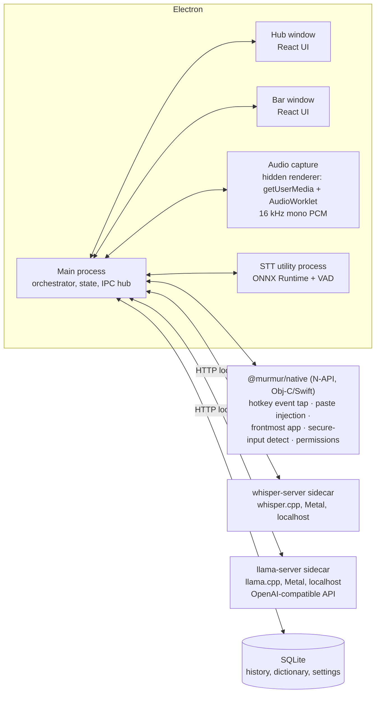

# Murmur — Product & Engineering Plan

**A local-first dictation app for macOS.** Hold a key, speak, release — polished text appears wherever your cursor is. The user experience mirrors Wispr Flow, but every byte of audio and text stays on the machine: speech-to-text and text polishing both run on local models that the user chooses. One hard constraint on that choice: the model catalog is **US-only** — every listed model comes from a US-based organization, enforced by the catalog itself (§8).

> Status: v1.1 — execution in progress.
> Decision log — **2026-08-05**: model catalog restricted to US-origin models only (owner decision). Non-US entries removed; the restriction is enforced by the catalog's origin policy (§8), and even utility models (VAD) comply (§5).

---

## 1. Why this exists

- Company policy forbids cloud dictation tools (Wispr Flow, Superwhisper cloud modes, etc.) because dictated audio/text leaves the machine.
- Existing local tools don't combine all of: Wispr-Flow-grade UX, an LLM "polishing" pass, and model choice inside a compliance-friendly, US-only catalog.
- Goal: a tool an IT/security team can approve at a glance — **no audio, transcript, or telemetry ever leaves the device**. The only network traffic is model downloads, which are user-initiated and auditable.

### Goals (v1)

1. System-wide push-to-talk dictation on macOS: hold hotkey → speak → release → text inserted into the frontmost app.
2. Fully local speech-to-text (STT) and local LLM polishing (filler removal, punctuation, formatting, tone).
3. User-selectable models for both stages, from a curated catalog **restricted to models from US-based organizations** (hard policy, §8), each labeled with origin, license, size, and hardware needs — plus "bring your own model" (a GGUF/ONNX file or a local OpenAI-compatible endpoint; imports bypass the catalog and are labeled origin-unverified).
4. Wispr Flow's interface shape: a floating **Bar** (recording pill) + a **Hub** window (history, dictionary, style, settings) + menu-bar presence.
5. Signed, notarized Electron app distributed as a DMG (not Mac App Store — see §16).

### Non-goals (v1)

- Windows/Linux (Electron keeps the door open; macOS-only integrations are isolated behind an interface).
- Mobile, sync, accounts, teams.
- Shipping Windows/Linux **in v1**. Both are now on the roadmap (M7/M8, §4.1) — macOS ships first, and the platform layer is isolated so the ports are additive, not rewrites.
- Real-time streaming captions (arrives in M5 as an upgrade; v1 transcribes on key-release).
- Reusing anything *from* Wispr Flow itself. The UI is a deliberate, close recreation of Flow's (§2), but built entirely from our own code and artwork — nothing extracted from their app bundle, and their name/logo stay out.

---

## 2. UX specification (mirroring Wispr Flow's shape)

Wispr Flow's desktop app lives in two places: the **Flow Bar** (floating pill at the bottom of the screen) and the **Hub** (main window for history/personalization/settings), plus a menu-bar item. Murmur adopts the same triad.

**Fidelity decision:** the UI is a *close copy* of Flow's — same layout, same components, same geometry and motion, recreated by eye from the real product. Two hard limits keep that clean: (1) nothing is ever extracted from Wispr Flow's app bundle — every icon, animation, and stylesheet here is written from scratch; (2) their name and logo are never used — the product is Murmur, with its own mark. Within those limits, matching their look and feel as closely as we can is an explicit goal, not a risk to minimize.

### 2.1 The Bar (floating dictation pill — faithful recreation of the Flow Bar)

The signature element: a small dark capsule floating at the bottom-center of the screen that expands with a live waveform while you speak. Recreate it closely.

**Geometry & look**

- Anchored bottom-center of the display containing the focused window, ~10 px above the screen edge; floats above the Dock and full-screen apps (`screen-saver` window level, all Spaces, `visibleOnFullScreen`).
- Idle: a ~64 × 22 px capsule; near-black background (≈ `rgba(20,20,24,0.92)`) with subtle backdrop blur, 1 px hairline border `rgba(255,255,255,0.08)`, soft drop shadow; a few dim static waveform dots hint at the mic.
- Visibility modes matching Flow: **Show while dictating** (default) · Always show · Hidden (hotkey still works).
- Every state change animates width/opacity with a ~150 ms ease-out spring — the pill morphs, never jumps or reflows.

**States**

| State | Visual | Trigger |
|---|---|---|
| Idle | small capsule, dim dots | per visibility mode |
| Listening | expands to ~160 px; 24–32 thin vertical bars (~2 px wide, 2 px gap) dancing with live mic amplitude at 60 fps, white-on-dark | hotkey down |
| Hands-free | same + small persistent indicator dot for the latched mode | double-tap hotkey (exit: tap again or Esc) |
| Processing | bars collapse into a left→right shimmer sweep | hotkey up |
| Inserted | quick ✓ pulse, then contracts to idle or hides | text injected |
| Error | warm-red tint, pill expands to fit a short message ("Didn't catch that", "Mic in use", "Secure field — can't type here"), auto-dismiss ~2.5 s | failure |

**Interaction**

- Non-activating panel: never steals focus from the app being dictated into.
- Click-through everywhere except the pill itself; hovering expands it slightly to reveal cancel (×), mic picker, and "open Hub"; Esc cancels while listening.
- Follows the active display; optional pin-to-one-display setting.

**Implementation** — one frameless transparent window sized to the largest state; the pill is drawn by the Bar renderer (React + a canvas waveform fed ~30 Hz amplitude frames over IPC, interpolated to 60 fps). No transcript preview in v1; streaming partial text lands in the pill in M5, as in Flow.

### 2.2 The Hub (main window)

Left sidebar navigation, content pane right — Wispr Flow's layout, tracked closely in visual language too: system font (SF Pro), warm neutral light theme + near-black dark theme, large-radius cards, generous whitespace, icon-labeled sidebar items, stats as friendly headline numbers. Sections:

1. **Home / History** — reverse-chronological feed of dictations: polished text (primary), expandable raw transcript, target app icon, duration, copy button, delete. Header stats like Flow's: total words dictated, average WPM, daily streak. Full-text search.
2. **Dictionary** — user-managed vocabulary: proper nouns, jargon, acronyms + optional "replace X with Y" rules (e.g., "murmer → Murmur", "eta → ETA"). Fed to both STT biasing and the polish prompt (§7.4). "Add from correction" flow later (M4).
3. **Style** — tone controls per app category (Personal / Work / Email / Other), mapped from the frontmost app's bundle ID. Options per category: capitalization/punctuation strictness, formality, emoji allowance, filler-word handling. Plus a global "polishing level": Off (raw transcript) / Clean (punctuation, fillers, self-corrections) / Rewrite (tone + structure).
4. **Models** — the model manager (§8): pick STT model, pick polish model, download/delete, disk usage, origin & license badges (US-only catalog, policy visibly enforced), custom model import, advanced: external OpenAI-compatible endpoint (e.g., company-approved LM Studio/Ollama).
5. **Settings** — hotkey config (default: hold `fn`, like Flow; alternatives Right-⌘/Right-⌥ for external keyboards), double-tap for hands-free, mic selection, language(s), launch at login, audio retention toggle (default **off** — audio deleted after transcription), history retention window, appearance (system/dark/light).
6. **Help** — permissions status panel (re-check/fix buttons), troubleshooting, logs export (local only).

### 2.3 Menu bar

Template icon (mic glyph; subtle state change while listening). Menu: Open Hub · Start hands-free dictation · Mic picker · Language · Pause Murmur · Quit. No Dock icon by default (`LSUIElement`), toggleable.

### 2.4 Onboarding (first run)

1. Welcome → 2. **Microphone** permission → 3. **Accessibility** permission (for text insertion) → 4. **Input Monitoring** permission (for the global hotkey) → 5. Pick + download a starter model pair with disk-size shown (offer a "smallest" and "recommended" bundle) → 6. Interactive tutorial: "hold `fn` and say *testing one two three*" into a practice text field → 7. Done; note about macOS's built-in double-fn dictation conflict with a one-click "open Keyboard settings" to disable it.

Each permission screen shows exactly why it's needed and what is *not* done (no keylogging — the tap listens only for the configured hotkey; no screen reading).

---

## 3. System architecture

Electron app + native glue + local inference sidecars. The renderer never touches models, audio devices are read in one place, and inference runs outside the Electron main process so the UI never jitters.



### 3.1 Process roles

- **Main process** — the state machine (idle → listening → transcribing → polishing → inserting), window/tray management, model lifecycle, settings, SQLite. Typed IPC contract shared with renderers.
- **Hub / Bar windows** — plain React; no Node integration, context-isolated, talk over typed IPC only.
- **Audio capture** — a hidden renderer using `getUserMedia` + `AudioWorklet` downsampling to 16 kHz mono Float32 frames streamed to main via IPC. Renderer-side capture avoids native audio code and gets device-picker + level metering for free. (If latency or reliability disappoints, fallback plan: AVAudioEngine in `@murmur/native`.)
- **STT utility process** — Electron `utilityProcess` hosting **ONNX Runtime** (`onnxruntime-node`, Microsoft) for ONNX models (Parakeet, Moonshine, NVIDIA NeMo streaming models) plus the VAD stage (§5). The thin decode loops are our own code (§6.1). Keeps models resident between utterances; crash-isolated and restartable.
- **whisper-server sidecar** — bundled `whisper.cpp` server binary (Metal + Core ML on Apple Silicon) for the Whisper family. Spawned on demand, bound to `127.0.0.1` on a random port with a per-session auth token; model stays loaded between utterances.
- **llama-server sidecar** — bundled `llama.cpp` server (Metal) exposing the OpenAI-compatible chat API for the polishing pass. Because polishing already speaks OpenAI-compatible HTTP, "use an external local endpoint" (Ollama / LM Studio / company-hosted vLLM) is the same code path with a different base URL.
- **`@murmur/native`** — one small N-API module (Obj-C/Swift) for everything Electron can't do: CGEventTap hotkey listening (incl. the `fn` key via `flagsChanged`), paste injection, frontmost-app lookup, secure-input detection, permission checks/prompts. Detailed in §4.

### 3.2 The dictation loop (happy path)

1. Native tap reports hotkey-down → main enters *listening*, shows Bar, starts audio capture.
2. Hotkey-up → stop capture, VAD-trim the buffer, show *processing*.
3. Buffer → active STT engine (utility process or whisper-server) → raw transcript.
4. Dictionary replacements applied; if polishing is on → llama-server with the tone profile for the frontmost app's category → polished text. (Utterances under ~3 words skip polish by default — not worth the latency.)
5. Injection: save clipboard → set clipboard to text → synthetic ⌘V via native module → restore clipboard (~150 ms later). Fallback: AX `AXUIElement` insertion for apps that block synthetic keystrokes; if the focused field has **secure input** enabled (password fields), refuse with a Bar error instead of typing.
6. Persist history row (raw + polished + app + timings), update stats, hide Bar.

Cancel paths: Esc during listening; empty/silent audio → "No speech detected"; every stage has a timeout that surfaces a Bar error rather than hanging.

---

## 4. macOS integration details (the hard, load-bearing part)

| Concern | Approach | Permission |
|---|---|---|
| Global hold-to-talk hotkey, incl. `fn` | `CGEventTap` (listen-only) for `keyDown/keyUp/flagsChanged`; `fn` arrives as `flagsChanged` with `.maskSecondaryFn`. Debounce; double-tap detection for hands-free. Electron's `globalShortcut` cannot do key-up or `fn`, hence native. | Input Monitoring |
| Text insertion | Clipboard-swap + synthetic ⌘V (`CGEventPost`), the same technique Flow-class apps use; AX insertion fallback; never type into secure input (`IsSecureEventInputEnabled` check). | Accessibility |
| Frontmost app (for tone category + history) | `NSWorkspace.frontmostApplication` bundle ID. No window titles, no screen content. | none |
| Mic capture | `getUserMedia` in hidden renderer; `com.apple.security.device.audio-input` entitlement + `NSMicrophoneUsageDescription`. | Microphone |
| Permission UX | `AXIsProcessTrustedWithOptions`, `CGPreflightListenEventAccess`/`CGRequestListenEventAccess`, `AVCaptureDevice.authorizationStatus` — surfaced in onboarding + Help panel with deep links into System Settings panes. | — |
| Conflict: macOS built-in dictation on double-`fn` | Detect setting, warn during onboarding, link to Keyboard settings. | — |
| Bar window | Frameless, transparent, `screen-saver` level, all-Spaces + `visibleOnFullScreen`, non-activating panel behavior, click-through except controls. | — |

Prototype-stage shortcut: `uiohook-napi` can stand in for the event tap during M1 development, but the plan of record is our own tap in `@murmur/native` — `fn` handling, key *suppression* while dictating (so hold-`fn` doesn't also trigger app shortcuts), and double-tap timing all want first-party control.

Bundled sidecar binaries (`whisper-server`, `llama-server`) are compiled in CI for arm64 + x86_64, code-signed with hardened runtime, and shipped inside `Contents/Resources/bin/` (notarization requirement — see §16 risks).

### 4.1 Windows & Linux ports (planned — M7/M8)

Only `@murmur/native` and packaging are per-OS; the inference stack, Electron shell, and the entire Hub/Bar UI are already cross-platform. A port implements this table plus an installer — nothing else changes:

| Concern | Windows (M7) | Linux (M8, best-effort) |
|---|---|---|
| Hold-to-talk hotkey | low-level keyboard hook (`SetWindowsHookEx` WH_KEYBOARD_LL) in the native module, with key suppression | X11: XGrabKey/XInput2; Wayland: GlobalShortcuts portal where the compositor supports it |
| Text insertion | clipboard swap + `SendInput` Ctrl+V; UI Automation fallback | X11: XTEST Ctrl+V; Wayland: virtual-keyboard protocol, else clipboard-assist mode |
| Frontmost app (tone category) | `GetForegroundWindow` → process name | X11: `_NET_ACTIVE_WINDOW`; Wayland: often unavailable → falls back to the global default tone |
| GPU acceleration | llama.cpp/whisper.cpp Vulkan (or CUDA) builds; CPU int8 STT via ONNX Runtime | same (Vulkan/CPU) |
| OS permissions | none beyond the mic privacy toggle | none |
| Tray + Bar | system tray; Bar works as-is | StatusNotifier tray; Bar solid on X11, per-compositor on Wayland |
| Packaging | signed NSIS installer + winget manifest + auto-update | AppImage + .deb + Flatpak |

Sequencing: Windows right after macOS v1.0 (well-trodden mechanics). Linux last and explicitly best-effort — Wayland fragments global hotkeys and synthetic paste across compositors, so Linux ships X11-first with a published Wayland support matrix.

---

## 5. Audio pipeline

- Format: 16 kHz mono Float32 (what every candidate STT model wants). Downsample in an `AudioWorklet`; ship ~100 ms frames over IPC.
- Pre-roll ring buffer: capture starts *on hotkey-down*, but keep a ~300 ms rolling pre-buffer once the mic stream is warm so first syllables aren't clipped; mic stream is opened lazily on first dictation and kept warm for a configurable idle window (default 5 min) to avoid cold-start latency.
- **VAD (no-ML, policy-clean)**: an energy/spectral gate in the WebRTC-VAD lineage, implemented in-process — trims leading/trailing silence before STT and auto-finalizes hands-free utterances after ~800 ms of silence; hard cap per-utterance length (default 5 min, configurable). Deliberately *not* Silero VAD (non-US origin): the US-only policy holds even for utility models.
- Echo/noise: rely on macOS voice-processing input (`echoCancellation: true` constraint) — good enough v1; revisit if AirPods/laptop-mic feedback complaints appear.
- Audio is held in memory only and discarded after transcription unless the user opts into retention (§10).

---

## 6. Speech-to-text layer

### 6.1 Engine abstraction

```ts
interface SttEngine {
  id: string;                       // "whisper-cpp" | "onnx-runtime" | future
  load(model: ModelRef, opts: SttOptions): Promise<void>;   // model stays resident
  transcribe(pcm: Float32Array, opts: UtteranceOpts): Promise<Transcript>;
  transcribeStreaming?(frames: AsyncIterable<Float32Array>): AsyncIterable<PartialTranscript>; // M5
  unload(): Promise<void>;
}
```

Two engines cover the whole catalog:

| Engine | Runs | Why |
|---|---|---|
| **ONNX Runtime** (`onnxruntime-node`, Microsoft — in the utility process) | Parakeet (NVIDIA's own NeMo→ONNX export), Moonshine (official ONNX release), NeMo streaming models (M5) | US-governed runtime; CPU int8 is real-time on any Mac; the decode loops (TDT greedy decode, ~200 lines) are our code, validated against NVIDIA reference transcripts |
| **whisper.cpp** (`whisper-server` sidecar) | Whisper family (large-v3-turbo, distil, quantized) | Best Whisper performance on Apple Silicon (Metal + Core ML encoder); Whisper remains the multilingual quality bar |

A possible third path — **audio-LLMs via llama.cpp** — is deferred until a US-origin audio-LLM matures in local runtimes (§6.3).

### 6.2 Curated STT catalog (v1) — US-origin only

Only models from US-based organizations are listed. The picker still shows **origin, license, size, languages, engine** for every entry so the policy is auditable at a glance. Sizes are quantized on-disk estimates.

| Model | Origin | License | Disk | Languages | Engine | Notes |
|---|---|---|---|---|---|---|
| **Parakeet-TDT 0.6B v3** (NVIDIA) | 🇺🇸 US | CC-BY-4.0 | ~650 MB int8 | en + 24 European langs | onnx-runtime | Fastest high-accuracy option; **recommended default** |
| **Parakeet-TDT 0.6B v2** (NVIDIA) | 🇺🇸 US | CC-BY-4.0 | ~650 MB int8 | en | onnx-runtime | English-only alternative |
| **Whisper large-v3-turbo** (OpenAI) | 🇺🇸 US | MIT | ~1.6 GB q5 | ~100 languages | whisper.cpp | Multilingual quality bar |
| **Whisper small.en / tiny.en** (OpenAI) | 🇺🇸 US | MIT | 75–500 MB | en | whisper.cpp | Low-RAM fallback; small.en is the M1 bring-up model |
| **Distil-Whisper large-v3.5** (Hugging Face, NYC) | 🇺🇸 US | MIT | ~750 MB | en | whisper.cpp | ~2× Whisper-large speed at near-parity accuracy |
| **Moonshine base** (Useful Sensors) | 🇺🇸 US | MIT | ~60 MB | en | onnx-runtime | Tiny; old-Intel-Mac tier |

Watch list (US-origin, add when a local ONNX/GGML runtime path is proven; the catalog is a signed JSON file the app can update without a release, §8): NVIDIA Canary / Canary-Qwen, IBM Granite Speech.

Removed by policy (previously listed): SenseVoice, Paraformer, FireRedASR (🇨🇳); Voxtral, Kyutai STT (🇫🇷); Cohere ASR (🇨🇦). The catalog's origin allowlist (§8) is what keeps them out — not just this document.

**Recommended defaults:** 8 GB Mac → Whisper small.en or Moonshine; 16 GB+ → Parakeet v3 (speed) or Whisper large-v3-turbo (multilingual).

### 6.3 Audio-LLM combo mode (deferred)

A single audio-LLM doing transcription **and** polishing in one pass stays architecturally attractive (one model, one latency budget), and the llama-server sidecar already provides the plumbing. Deferred because the strong open audio-LLMs today are non-US-origin and therefore out of policy. Revisit if a US-origin option (e.g., the Ultravox line) matures with solid llama.cpp support.

### 6.4 Accuracy aids

- **Dictionary biasing**: Whisper receives dictionary terms via `initial_prompt`; on the ONNX Runtime path (Parakeet/Moonshine) biasing is post-STT for now — replacement rules plus the polish prompt fix casing and spelling — with shallow-fusion hotword biasing on the backlog (§18).
- **Post-STT replacement rules** from the Dictionary run before polishing.
- Language: manual selection in v1 (auto-detect only where the model does it natively, e.g. Whisper/SenseVoice); per-language model routing later.

---

## 7. Polishing layer (local LLM)

### 7.1 Engine

`llama-server` (llama.cpp) sidecar with the OpenAI-compatible `/v1/chat/completions` API. Model resident between utterances; unloadable after idle timeout (configurable) to release RAM. Alternative backend = any OpenAI-compatible **local** URL (Ollama, LM Studio, company vLLM box) — same client code; the app warns if the endpoint isn't loopback/RFC-1918 so "local-only" stays honest.

### 7.2 Curated polish-model catalog (v1) — US-origin only

Task profile: short-input, short-output rewriting — needs instruction-following and speed, not reasoning. Small models excel here.

| Model | Origin | License | Disk (Q4) | RAM tier | Notes |
|---|---|---|---|---|---|
| **Gemma 3 4B-it** (Google) | 🇺🇸 US | Gemma license | ~2.6 GB | 16 GB | **Recommended default** — best small-model rewriting quality |
| **Gemma 3 1B-it** (Google) | 🇺🇸 US | Gemma license | ~800 MB | 8 GB | Low-RAM default |
| **Phi-4-mini-instruct 3.8B** (Microsoft) | 🇺🇸 US | MIT | ~2.4 GB | 16 GB | MIT — cleanest license for strict environments |
| **Llama 3.2 3B / 1B Instruct** (Meta) | 🇺🇸 US | Llama license | 0.8–2 GB | 8–16 GB | Ubiquitous, well-tested quants |
| **OLMo 2 7B Instruct** (Allen Institute for AI) | 🇺🇸 US | Apache-2.0 | ~4.5 GB | 16 GB+ | Fully open (data + weights) — easiest compliance story |
| **Granite 3.3 2B / 8B Instruct** (IBM) | 🇺🇸 US | Apache-2.0 | 1.5–5 GB | 8–16 GB | Enterprise-friendly |
| *Bring your own GGUF* | — | — | — | — | File picker or HF repo ID; labeled origin-unverified |

Removed by policy (previously listed): Qwen3, GLM-Edge (🇨🇳); Mistral/Ministral (🇫🇷); EuroLLM (🇪🇺); Falcon (🇦🇪).

(Exact SKUs re-verified when the catalog file is authored — small-model releases move monthly; catalog updates don't require app releases, §8.)

### 7.3 Latency budget (hotkey-up → text inserted, 5 s utterance, M-series 16 GB)

| Stage | Target |
|---|---|
| VAD trim + transfer | < 50 ms |
| STT (Parakeet/SenseVoice int8) | 150–500 ms |
| STT (Whisper turbo, Metal) | 500–1000 ms |
| Polish (Gemma 3 1B/4B Q4, ~50 tok out) | 300–800 ms |
| Injection | < 100 ms |
| **End-to-end target** | **≤ 1.5 s typical, ≤ 2.5 s with Whisper turbo** |

Tricks: skip polish for ≤3-word utterances; cap polish output tokens relative to input length; keep both models resident; warm the llama context with the system prompt (prompt caching) so per-utterance prompt processing is minimal; thinking-mode models always run with thinking off.

### 7.4 Polish prompt design

System prompt assembled per utterance from: polishing level (Clean/Rewrite), tone profile for the frontmost app category, dictionary terms, output-language rule ("reply in the transcript's language"), and hard rules: *never answer questions, never add content, never translate — you are a transcription editor, output only the edited text.* Few-shot examples ship per polishing level. Self-correction handling ("send it Tuesday — no wait, Wednesday" → "send it Wednesday") is the marquee Clean-level behavior and gets its own eval set (§13.4). Numbered/bulleted list detection ("one… two… three…" → markdown list) at Rewrite level, matching Flow's auto-formatting.

Guardrail: if polish output diverges wildly in length from input (hallucination guard), fall back to the raw transcript and log it (locally).

---

## 8. Model manager

- **Catalog** = a versioned, signed JSON file shipped with the app (updatable independently of app releases): model metadata, origin, license, quant variants, SHA-256 checksums, download URLs with mirrors.
- **Sources**: Hugging Face only; all downloads resumable, checksum-verified, into `~/Library/Application Support/Murmur/models/`.
- UI: per-model card (origin flag, license, disk, RAM tier, languages), download progress, delete, "active" markers for the current STT/polish pair, total disk usage.
- **Origin policy (enforced, not advisory)**: every catalog entry carries an `origin` field and the catalog carries an `originPolicy` allowlist, compiled into the app as `["US"]`. Entries failing the allowlist are rejected at catalog load — a mirrored or hand-edited catalog can't smuggle a non-US model into the picker.
- **Custom models**: local file import (GGUF for polish/whisper.cpp; ONNX bundle for the ONNX Runtime engine) or HF repo reference; these bypass the catalog by definition and are clearly labeled "user-supplied — origin unverified".
- Hardware advisor: detect chip + RAM (`systemProfiler`/`os` APIs), badge each model *Runs well / Tight / Not recommended*.

---

## 9. Data model (SQLite via better-sqlite3, WAL mode)

- `dictations(id, ts, raw_text, polished_text, app_bundle_id, app_category, duration_ms, stt_model, polish_model, timings_json)` + FTS5 index on both text columns.
- `dictionary(id, term, replacement NULL, enabled)` — NULL replacement = vocabulary-boost-only term.
- `style_profiles(category, formality, fillers, emoji, level, custom_instructions)`.
- `settings(key, value)` — hotkey, models, mic, language, retention, etc.
- Optional `audio/` folder (only when retention opted in), files named by dictation id, auto-pruned by retention window.
- Everything under `~/Library/Application Support/Murmur/`; "Export my data" (JSON/CSV) and "Delete everything" buttons in Settings.

---

## 10. Privacy & security posture (the selling point — make it auditable)

1. **No telemetry, no analytics, no accounts, no crash uploads.** Crash reports write to local disk; the user chooses whether to share them.
2. Network access happens **only** for: model catalog refresh + model downloads (user-initiated, to Hugging Face) and the optional update check (off by default in v1; see §16). Enforced in code by a single fetch wrapper with an allowlist, and documented so IT can verify with Little Snitch/proxy logs.
3. Sidecars bind to `127.0.0.1` with a random port + bearer token generated per launch (no other local user/process can use our inference servers or read prompts).
4. Audio in memory only by default; history is local SQLite; both retention windows user-controlled.
5. The event tap is **listen-only for the configured hotkey** — key events other than the hotkey are never logged, buffered, or transmitted; this is stated in-app and verifiable in source.
6. Open-sourcing this repo (MIT) is the credibility multiplier for corporate approval — recommended.
7. Signed + notarized builds; SBOM generated in CI for supply-chain review.

---

## 11. Tech stack

| Layer | Choice | Rationale |
|---|---|---|
| Shell | **Electron 3x + TypeScript** | Requirement; mature tray/multi-window/utilityProcess support |
| Bundler/scaffold | **electron-vite** | Fast HMR for three renderer targets (Hub, Bar, audio) |
| UI | **React + Tailwind + Radix primitives** | Fast to build a polished Hub; Bar is a tiny standalone bundle |
| State | zustand (renderer) + main-process store as source of truth over typed IPC | One writer, many readers |
| IPC | Hand-rolled typed contract (zod-validated) | Small surface; avoids preload sprawl |
| DB | better-sqlite3 + FTS5 | Sync, fast, battle-tested in Electron |
| STT | ONNX Runtime (`onnxruntime-node`, Microsoft) + whisper.cpp server sidecar | §6 |
| LLM | llama.cpp server sidecar (OpenAI-compatible) | §7 |
| Native | `@murmur/native` N-API module (Obj-C/Swift, node-gyp) | §4 |
| Packaging | electron-builder → signed/notarized DMG, universal (arm64 + x64) | Direct distribution |
| CI | GitHub Actions (macos-14 arm64 + macos-13 x64): lint, typecheck, unit, sidecar builds, e2e smoke (Playwright), package + notarize on tag | Reproducible sidecar binaries |
| Testing | vitest (unit) · Playwright for Electron (UI) · golden-file evals for polish prompts (§13.4) · recorded-audio fixture suite for STT wiring | |

### 11.1 Software provenance & the strict-US fallback

Model origin is policy-clean by construction (§8). For reviewers who extend the bar to *software governance*:

| Component | Governance | Status |
|---|---|---|
| Electron / Chromium / Node, React, ONNX Runtime, better-sqlite3 | US foundations & corporations (OpenJS, Google, Meta, Microsoft) | clean |
| whisper.cpp / llama.cpp | MIT-licensed community OSS led by an EU-based maintainer — no foreign *corporate* governance; we vendor, version-pin, and compile from source in CI with SBOM | disclosed up front; typically passes license+SBOM review |
| sherpa-onnx (Xiaomi-affiliated, CN) | — | **removed from the product** (2026-08-05) |

If review rejects EU-community-led OSS outright, the fallback is pre-wired because every engine sits behind an interface: STT consolidates fully onto ONNX Runtime (Microsoft publishes optimized Whisper ONNX builds — whisper.cpp retires), and polishing swaps the llama.cpp sidecar for an **ONNX Runtime GenAI** sidecar running Microsoft's official Phi-4-mini ONNX build, with **Apple MLX** (Apple-governed, Metal-fast) evaluated as the Mac performance path. That stack is US-corporate-governed end to end; its cost is polish latency on CPU (start with 1B-class defaults until the MLX path lands), measured against the M5 bench before committing.

Prior art to study/borrow from (all open source, all validate feasibility): **VoiceInk** (macOS native, whisper.cpp local dictation), **Handy** (cross-platform Tauri push-to-talk), **Vibe** (whisper transcription UI). Murmur's differentiators: Flow-grade UX + polish stage + model choice with origin labeling.

---

## 12. Repository layout

```
murmur/
├── PLAN.md                     # this document
├── package.json                # workspaces
├── apps/desktop/               # the Electron app
│   ├── src/main/               # main process: state machine, windows, tray,
│   │   ├── dictation/          #   loop orchestrator, injection, audio broker
│   │   ├── engines/            #   SttEngine/PolishEngine impls, sidecar mgmt
│   │   ├── models/             #   catalog, downloads, storage
│   │   ├── store/              #   sqlite, settings, history, dictionary
│   │   └── ipc/                #   typed contract
│   ├── src/preload/
│   ├── src/renderer/hub/       # React app: Home, Dictionary, Style, Models, Settings, Help
│   ├── src/renderer/bar/       # the pill
│   ├── src/renderer/audio/     # hidden capture page + AudioWorklet
│   └── electron-builder.yml
├── packages/native/            # @murmur/native N-API module (Obj-C/Swift)
├── packages/shared/            # types, IPC schema, catalog schema
├── resources/catalog/          # models.json (+ signing)
├── scripts/sidecars/           # build whisper.cpp / llama.cpp universal binaries
└── .github/workflows/
```

---

## 13. Roadmap

Milestones are demoable slices; each has acceptance criteria. Rough calendar assumes one focused developer; halve wall-clock with two.

### M0 — Foundations (week 1)
Scaffold (electron-vite, workspaces, TS strict), tray + empty Hub/Bar windows, typed IPC skeleton, CI (lint/typecheck/test on mac runners), signing certs wired, sidecar build scripts producing signed universal `whisper-server`/`llama-server`.
**Accept:** `npm run dev` shows tray + windows; CI green; notarized empty-shell DMG installs and launches on a clean Mac.

### M1 — Core dictation loop (weeks 2–4) ← *the risk burn-down milestone*
`@murmur/native` v0 (event tap: hold-`fn` + one alternate key, permissions API, paste injection, secure-input detect), audio capture renderer, VAD, whisper.cpp path with a small Whisper model, Bar with listening/processing/inserted/error states, onboarding flow with the three permissions, history rows written.
**Accept:** on a clean machine, onboarding → hold `fn`, speak 5 s, release → correct text lands in Notes/Slack/Chrome/Terminal in ≤ 2.5 s; secure fields refused gracefully; Esc cancels; survives display sleep and app relaunch.

### M2 — Model manager + engine abstraction (weeks 5–6)
ONNX Runtime utility process (Parakeet + Moonshine; TDT greedy decode validated against NVIDIA reference transcripts), catalog JSON + downloader (resume, SHA-256), Models UI with origin/license badges and visible US-only policy enforcement, hardware advisor, STT model switching without restart, language selection, mic picker, launch-at-login, hotkey customization UI.
**Accept:** fresh install reaches Parakeet or Whisper turbo in two clicks; a tampered catalog containing a non-US entry is rejected with a visible error; model switch < 10 s; downloads survive network drops.

### M3 — Polishing (weeks 7–8)
llama-server sidecar + lifecycle (idle unload), polish pipeline with levels Off/Clean/Rewrite, prompt assembly (tone per app category, dictionary, few-shots), Style UI, Dictionary UI + STT hotword/initial-prompt biasing + replacement rules, external OpenAI-compatible endpoint option, hallucination guard, ≤3-word skip rule.
**Accept:** "um so basically we should uh ship it on on tuesday no wednesday" → "We should ship it on Wednesday." via Gemma 3 4B in ≤ 800 ms added latency; polish eval suite (§13.4) ≥ 90% pass; raw-transcript fallback observable.

### M4 — History, stats, personalization depth (weeks 9–10)
Hub Home with search (FTS5), copy/delete, stats (words, WPM, streak), per-app category mapping UI, audio retention opt-in + auto-prune, data export/delete-all, Help panel with permission re-checks, polish pass over visual design.
**Accept:** 1k-row history searches < 50 ms; stats match hand-computed fixtures; export produces valid JSON/CSV.

### M5 — Latency & streaming upgrades (weeks 11–12)
Streaming STT (NVIDIA NeMo streaming models on ONNX Runtime; evaluate Moonshine's streaming mode) with live partial text in the Bar, hands-free double-tap mode with VAD auto-finalize, prompt caching for polish, Intel-Mac performance pass.
**Accept:** perceived latency (release → text) ≤ 1 s with streaming pipeline on M-series; hands-free dictates three consecutive utterances without touching the keyboard.

### M6 — Distribution & easy install (week 13)
Release automation: tag → CI builds, signs, notarizes, staples, and publishes the universal DMG to **GitHub Releases** with SHA-256 checksums; auto-update via electron-updater with beta→stable channels (opt-in, off by default for corporate installs); **Homebrew cask** (`brew install --cask murmur`); a one-page **download site** (GitHub Pages) with an OS-detecting download button, checksums, and the IT one-pager (network/telemetry statement) linked; SBOM, user docs, license audit of bundled components, v1.0 tag.
**Accept:** a coworker with the link is dictating in < 5 min including model download, with no Gatekeeper warnings (notarized build); update flow verified; all bundled licenses documented.

### M7 — Windows port (post-1.0)
`@murmur/native` win32 backend (low-level keyboard hook, SendInput paste, foreground-app lookup), Vulkan/CPU sidecar builds, NSIS installer + Authenticode signing + winget manifest, Windows CI leg, QA matrix (Win 10/11).
**Accept:** M1-parity on Windows 11 — hold-key → text lands in Notepad/Teams/Chrome in ≤ 2.5 s; installer, auto-update, and download page verified.

### M8 — Linux port (post-1.0, best-effort)
X11 backend (XGrabKey + XTEST), StatusNotifier tray, AppImage/.deb/Flatpak packaging, documented Wayland support matrix (GlobalShortcuts portal where available).
**Accept:** M1-parity on Ubuntu LTS under X11; Wayland matrix published with per-compositor status.

### 13.4 Evals (built alongside M3, run in CI)
- **Polish golden set**: ~150 transcript → expected-output pairs per level (fillers, self-corrections, lists, emails, mixed-language), scored by exact/fuzzy match; run against every catalog polish model in a nightly job on a self-hosted Apple Silicon runner.
- **STT wiring set**: ~20 recorded WAV fixtures (accents, jargon from Dictionary, silence, 30 s ramble) asserting WER bounds per engine — catches integration regressions, not model quality.
- **Latency bench**: scripted loop reporting p50/p95 per stage per model tier; regression gate ±20%.

---

## 14. Performance targets & hardware tiers

| Tier | Machines | STT default | Polish default | Expected e2e (5 s utterance) |
|---|---|---|---|---|
| A | Apple Silicon ≥ 16 GB | Parakeet v3 / Whisper turbo | Gemma 3 4B Q4 | ≤ 1.5 s |
| B | Apple Silicon 8 GB | Whisper small.en / Moonshine | Gemma 3 1B Q4 (or polish Off) | ≤ 2 s |
| C | Intel Macs | Moonshine / Whisper tiny.en | polish Off by default | ≤ 3 s, best-effort |

RAM guardrail: warn before loading a combo whose working set exceeds ~60% of physical RAM; auto-unload polish model after idle.

---

## 15. Production readiness — definition of done & quality gates

The roadmap says what gets built; this section says when it is allowed to be called production. v1.0 does not ship until every box here is checked.

### 15.1 Reliability
- 48-hour soak on real hardware: app resident with regular dictations; zero crashes; main-process RSS stable (< 150 MB idle, models excluded); no listener/child-process leaks (counted before/after).
- Sidecar watchdog: a whisper/llama server exit triggers auto-restart with exponential backoff; surfaced to the user only after 3 consecutive failures; the state machine returns to a safe idle on every failure path — no dead ends, asserted by unit tests over the full transition table.
- Every stage of the dictation loop has a timeout and a user-visible error state; no silent hangs anywhere.
- Survives (manual QA script + automated where possible): sleep/wake mid-dictation, display hot-plug and resolution change, mic hot-swap (AirPods connecting/disconnecting while listening), Space switches and full-screen transitions, fast user switching, app relaunch while a model download is in flight.

### 15.2 Data safety
- SQLite in WAL mode; integrity check at boot; corrupt DB → timestamped backup + clean re-init, never a crash loop.
- Atomic settings writes (temp file + rename); versioned forward-only migrations with automatic pre-migration backup.
- Downloads land in temp files renamed only after checksum verification; partials are resumed or reaped; a checksum failure quarantines the file with a visible error.

### 15.3 Security & privacy (verified, not asserted)
- An integration test asserts the app contacts no host other than the Hugging Face download hosts (plus the update host when enabled) — run in CI behind a recording proxy.
- Sidecars: loopback bind + per-launch bearer token, both covered by tests; the token is never logged.
- IPC: every channel zod-validated at the boundary; renderer input treated as untrusted; no renderer-supplied file path reaches disk without normalization + allowlist (the downloader and model-import paths are the sensitive ones).
- Logs redact transcript content by default (verbose local debugging is opt-in); no analytics of any kind; `npm audit`/osv-scanner clean or explicitly waived in-repo; SBOM per release.

### 15.4 Release engineering
- CI on every PR: typecheck, lint, unit suite, main+renderer builds, and a Playwright smoke test (launch with the stubbed native layer → simulated dictation → Bar state assertions → history row written).
- Nightly on a self-hosted Apple Silicon runner: model-in-the-loop polish evals (§13.4) and the latency bench with a ±20% regression gate.
- Tagged releases: universal (arm64 + x86_64) build including sidecars and the native module, Developer ID signing, notarization + stapling, DMG + SBOM + CHANGELOG published together; the previous DMG is retained as the rollback path; auto-update ships to a beta channel before stable.
- Crash handling: local minidumps with per-release symbolication assets archived (no automatic upload — privacy posture, §10).

### 15.5 UX & accessibility bar
- VoiceOver labels and full keyboard navigation across the Hub; the Bar respects Reduce Motion; dark/light parity audit; text scaling 100–200%; a copy pass over every user-facing string — every error message names a next action.

### 15.6 Execution quality gates (how the code gets written)
- Every implementation stage lands only with install + typecheck + lint + tests + build green — no red-to-red baton passes between stages.
- A dedicated adversarial review stage follows implementation: independent review passes over (a) correctness of the dictation state machine and engine lifecycles, (b) security of the injection/IPC/downloader/token paths, (c) resource lifecycle (listeners, child processes, streams, windows), (d) macOS-specific correctness. Confirmed findings are fixed and re-verified, then a full-diff security review closes the stage.
- Honest boundary: development happens in a Linux container. Everything compilable and testable runs there, but permissions flows, the `fn` event tap, cross-app paste, Metal latency, and notarization can only be certified on physical Macs. The first on-Mac session executes the M1 acceptance checklist (§13) verbatim before any further feature work — "green in CI" is never conflated with "production".

## 16. Risks & mitigations

| Risk | Severity | Mitigation |
|---|---|---|
| `fn`-key capture flaky (OS updates, external keyboards, conflicts with macOS dictation) | High | Own event tap in native code; alternate default keys offered in onboarding; detect+warn about macOS double-fn dictation; integration tests on each macOS beta |
| Paste injection blocked by some apps (Electron apps with odd focus, RDP/VNC/VMs, secure input left on by e.g. password managers) | High | AX-insertion fallback; secure-input detection with clear Bar error naming the offending process (`SecureEventInput` owner); per-app quirk list |
| Notarization/hardened-runtime issues with bundled sidecar binaries + native module | Medium | Sign everything in CI from day one (M0 acceptance includes a notarized DMG); no downloaded executables ever — only model *data* files |
| Mac App Store impossible (event tap + AX are sandbox-incompatible) | Accepted | Direct DMG + Homebrew distribution; not a v1 concern |
| Latency disappoints on low-RAM machines | Medium | Tiered defaults (§14); polish-off mode; streaming in M5; honest hardware advisor |
| llama.cpp/whisper.cpp API churn across updates | Medium | Pin versions; sidecar HTTP API is our stable seam; upgrade deliberately with the bench suite as gate |
| In-house Parakeet decode loop subtly wrong | Medium | Golden-fixture tests against NVIDIA NeMo reference transcripts per model release; greedy TDT decode is small and well-documented; Whisper/Moonshine paths unaffected |
| Small-LLM polish quality (hallucinated edits) | Medium | Tight system prompt + few-shots, length-divergence guard with raw fallback, eval suite gating catalog entries |
| Model licensing/compliance concerns from employer | Low | US-only origin policy enforced by the catalog schema; origin + license surfaced in UI; catalog only lists redistributable-weight models; SBOM |
| Electron mic capture edge cases (device switching, AirPods handoff) | Low | Device-change listener re-opens stream; mic picker in Bar; fallback plan: native AVAudioEngine capture |
| Wispr Flow trade-dress proximity | Accepted | Close visual recreation is a deliberate choice for this personal/internal tool (§2). Kept clean by construction: recreated by eye in our own code/artwork, nothing extracted from their bundle, no use of their name/logo/marketing copy. Revisit only if Murmur is ever distributed commercially |

---

## 17. Open questions (defaults chosen; flag disagreement)

1. **Minimum macOS**: proposed macOS 13 Ventura+ (covers modern permission APIs; Electron support window). Intel supported but tier-C.
2. **Starter default**: onboarding proposes Parakeet v3 + Gemma 3 4B on 16 GB+ machines, Whisper small.en + Gemma 3 1B on 8 GB — one opinionated default per tier.
3. **Languages at launch**: English-first; multilingual available via Whisper large-v3-turbo and Parakeet v3's European languages — any must-have language to prioritize in evals?
4. **Open-source the repo?** Recommended (MIT) for IT-approval credibility — decision needed before v1.0.
5. **App name**: assuming **Murmur** (repo name) is the product name.

---

## 18. Backlog — post-v1 feature candidates

Ranked by value-for-effort; none block v1.0. The first two are the strongest differentiators local models make uniquely private.

1. **Command mode** (Flow parity; v1.1 flagship) — select text in any app, hold a *second* hotkey, speak an instruction ("tighten this up", "turn it into bullets", "reply yes but ask for an agenda") → the local LLM rewrites the selection in place. Reuses the whole pipeline: selection read via AX/clipboard round-trip, instruction prompt template, same injection path.
2. **Long-form transcription mode** — record meetings or voice memos (mic first; system audio later), chunked transcription with timestamps into a Hub document view, export as Markdown. Same engines, different loop (no paste).
3. **Re-polish from history** — any history row → "rewrite as email / casual / shorter"; result copied to clipboard. Cheap win that showcases the local LLM.
4. **Voice punctuation & commands toggle** — deterministic pre-polish handling of "period", "new line", "scratch that" for users who dictate punctuation explicitly.
5. **Clipboard-only mode** — per-app or global fallback that copies the result and notifies instead of pasting (RDP/VMs/locked-down apps).
6. **Auto-benchmark on first run** — a ~10 s on-device micro-bench picks default models per machine instead of static RAM tiers.
7. **Mic priority list** — ordered preferred devices (AirPods → built-in) with auto-switch and per-device input-gain memory.
8. **Menu-bar quick controls** — switch polishing level and language without opening the Hub.
9. **Voice snippets** — "insert my standup template" expands saved snippets; the Dictionary's bigger sibling.
10. **Local translation mode** (experimental) — dictate in language A, insert in language B via the polish LLM.
11. **Shared team dictionaries** — import/export dictionary packs as files (no server, keeps the zero-network posture).
12. **Shallow-fusion hotword biasing** for the ONNX Runtime STT path — restores strong dictionary boosting for Parakeet during decoding (today it's post-STT replacement + polish-prompt correction).

## 19. References

- Wispr Flow UX (Hub/Flow Bar/hotkeys/dictionary/tones): [navigating the app](https://docs.wisprflow.ai/articles/5096240724-navigating-the-wispr-flow-app-desktop-ios-and-android), [features](https://wisprflow.ai/features), [what is Flow](https://docs.wisprflow.ai/articles/2772472373-what-is-flow)
- STT landscape 2026: [Northflank open-source STT benchmarks](https://northflank.com/blog/best-open-source-speech-to-text-stt-model-in-2026-benchmarks), [Gladia open-source STT roundup](https://www.gladia.io/blog/best-open-source-speech-to-text-models), [local STT comparison](https://www.onresonant.com/resources/local-stt-models-2026)
- Small local LLMs 2026: [HF blog — open models to run locally](https://huggingface.co/blog/daya-shankar/open-source-llm-models-to-run-locally), [local LLM guide](https://klymentiev.com/blog/best-local-llm)
- Runtimes: [ONNX Runtime](https://github.com/microsoft/onnxruntime), [whisper.cpp](https://github.com/ggml-org/whisper.cpp), [llama.cpp](https://github.com/ggml-org/llama.cpp)
- Models (US-origin catalog): [Parakeet-TDT](https://huggingface.co/nvidia/parakeet-tdt-0.6b-v3), [Whisper](https://github.com/openai/whisper), [Distil-Whisper](https://huggingface.co/distil-whisper), [Moonshine](https://github.com/moonshine-ai/moonshine), [Gemma 3](https://huggingface.co/google/gemma-3-4b-it), [Phi-4-mini](https://huggingface.co/microsoft/Phi-4-mini-instruct), [Llama 3.2](https://huggingface.co/meta-llama/Llama-3.2-3B-Instruct), [OLMo 2](https://huggingface.co/allenai), [Granite](https://huggingface.co/ibm-granite)
- Prior art: [VoiceInk](https://github.com/Beingpax/VoiceInk), [Handy](https://github.com/cjpais/Handy), [Vibe](https://github.com/thewh1teagle/vibe)
